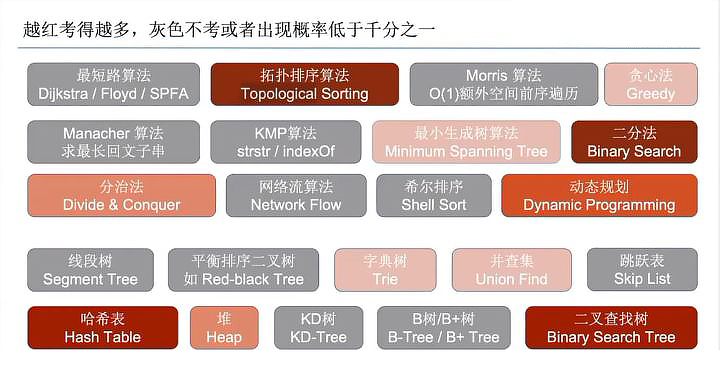
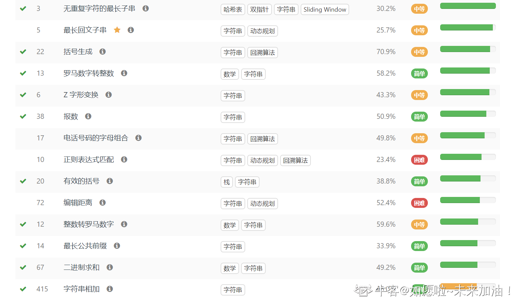
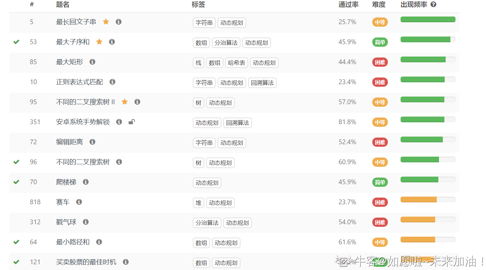
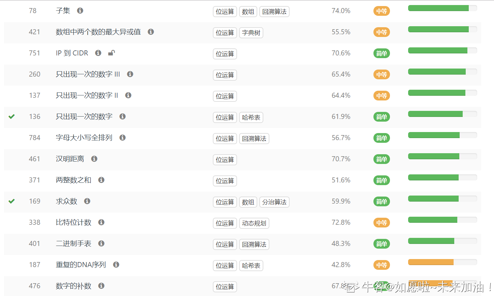
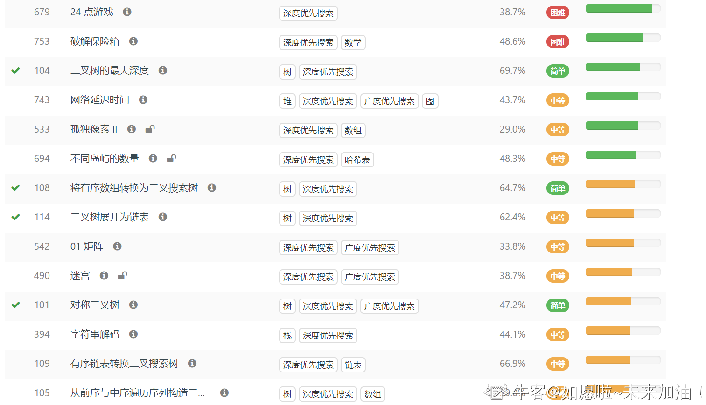

## 前端重难点攻坚指南(updating)

### Contents
-----------

- [前端重难点攻坚指南(updating)](#%E5%89%8D%E7%AB%AF%E9%87%8D%E9%9A%BE%E7%82%B9%E6%94%BB%E5%9D%9A%E6%8C%87%E5%8D%97updating)
- [### Contents](#contents)
- [### I. 面试阶段分析](#i-%E9%9D%A2%E8%AF%95%E9%98%B6%E6%AE%B5%E5%88%86%E6%9E%90)
- [### II. 个人介绍](#ii-%E4%B8%AA%E4%BA%BA%E4%BB%8B%E7%BB%8D)
    - [➣ 重点](#%E2%9E%A3-%E9%87%8D%E7%82%B9)
    - [➣ 描述在上一家公司的工作经历](#%E2%9E%A3-%E6%8F%8F%E8%BF%B0%E5%9C%A8%E4%B8%8A%E4%B8%80%E5%AE%B6%E5%85%AC%E5%8F%B8%E7%9A%84%E5%B7%A5%E4%BD%9C%E7%BB%8F%E5%8E%86)
    - [➣ 范例](#%E2%9E%A3-%E8%8C%83%E4%BE%8B)
    - [➣ 项目经历介绍](#%E2%9E%A3-%E9%A1%B9%E7%9B%AE%E7%BB%8F%E5%8E%86%E4%BB%8B%E7%BB%8D)
- [### III. 要点：HTML/CSS](#iii-%E8%A6%81%E7%82%B9htmlcss)
    - [➣ BFC及其应用](#%E2%9E%A3-bfc%E5%8F%8A%E5%85%B6%E5%BA%94%E7%94%A8)
    - [➣ 两列布局实现](#%E2%9E%A3-%E4%B8%A4%E5%88%97%E5%B8%83%E5%B1%80%E5%AE%9E%E7%8E%B0)
    - [➣ 1px问题](#%E2%9E%A3-1px%E9%97%AE%E9%A2%98)
    - [➣ 浮动布局相关](#%E2%9E%A3-%E6%B5%AE%E5%8A%A8%E5%B8%83%E5%B1%80%E7%9B%B8%E5%85%B3)
    - [➣ 位图和矢量图的区别](#%E2%9E%A3-%E4%BD%8D%E5%9B%BE%E5%92%8C%E7%9F%A2%E9%87%8F%E5%9B%BE%E7%9A%84%E5%8C%BA%E5%88%AB)
- [### IV. 要点：Javascript](#iv-%E8%A6%81%E7%82%B9javascript)
    - [➣ js类型的判断](#%E2%9E%A3-js%E7%B1%BB%E5%9E%8B%E7%9A%84%E5%88%A4%E6%96%AD)
    - [➣ 实现Call和Apply](#%E2%9E%A3-%E5%AE%9E%E7%8E%B0call%E5%92%8Capply)
    - [➣ 实现对象new操作](#%E2%9E%A3-%E5%AE%9E%E7%8E%B0%E5%AF%B9%E8%B1%A1new%E6%93%8D%E4%BD%9C)
    - [➣ Js实现继承](#%E2%9E%A3-js%E5%AE%9E%E7%8E%B0%E7%BB%A7%E6%89%BF)
    - [➣ 手写深拷贝和浅拷贝](#%E2%9E%A3-%E6%89%8B%E5%86%99%E6%B7%B1%E6%8B%B7%E8%B4%9D%E5%92%8C%E6%B5%85%E6%8B%B7%E8%B4%9D)
    - [➣ ES6新增特性](#%E2%9E%A3-es6%E6%96%B0%E5%A2%9E%E7%89%B9%E6%80%A7)
    - [➣ 移动端点击穿透问题](#%E2%9E%A3-%E7%A7%BB%E5%8A%A8%E7%AB%AF%E7%82%B9%E5%87%BB%E7%A9%BF%E9%80%8F%E9%97%AE%E9%A2%98)
    - [➣ 图片懒加载具体实现方案和思路](#%E2%9E%A3-%E5%9B%BE%E7%89%87%E6%87%92%E5%8A%A0%E8%BD%BD%E5%85%B7%E4%BD%93%E5%AE%9E%E7%8E%B0%E6%96%B9%E6%A1%88%E5%92%8C%E6%80%9D%E8%B7%AF)
    - [➣ 函数防抖和节流实现](#%E2%9E%A3-%E5%87%BD%E6%95%B0%E9%98%B2%E6%8A%96%E5%92%8C%E8%8A%82%E6%B5%81%E5%AE%9E%E7%8E%B0)
    - [➣ Js/Node的事件循环(宏任务、微任务)](#%E2%9E%A3-jsnode%E7%9A%84%E4%BA%8B%E4%BB%B6%E5%BE%AA%E7%8E%AF%E5%AE%8F%E4%BB%BB%E5%8A%A1%E5%BE%AE%E4%BB%BB%E5%8A%A1)
    - [➣ 页面加载会触发哪些事件](#%E2%9E%A3-%E9%A1%B5%E9%9D%A2%E5%8A%A0%E8%BD%BD%E4%BC%9A%E8%A7%A6%E5%8F%91%E5%93%AA%E4%BA%9B%E4%BA%8B%E4%BB%B6)
    - [➣ document.ready和window.onload的区别](#%E2%9E%A3-documentready%E5%92%8Cwindowonload%E7%9A%84%E5%8C%BA%E5%88%AB)
    - [➣ 闭包Closure](#%E2%9E%A3-%E9%97%AD%E5%8C%85closure)
    - [➣ 函数式编程思想的体现](#%E2%9E%A3-%E5%87%BD%E6%95%B0%E5%BC%8F%E7%BC%96%E7%A8%8B%E6%80%9D%E6%83%B3%E7%9A%84%E4%BD%93%E7%8E%B0)
    - [➣ vue双向绑定实现原理](#%E2%9E%A3-vue%E5%8F%8C%E5%90%91%E7%BB%91%E5%AE%9A%E5%AE%9E%E7%8E%B0%E5%8E%9F%E7%90%86)
    - [➣ Vue2.0与Vue3.0双向绑定，proxy实现](#%E2%9E%A3-vue20%E4%B8%8Evue30%E5%8F%8C%E5%90%91%E7%BB%91%E5%AE%9Aproxy%E5%AE%9E%E7%8E%B0)
    - [➣ React-Fiber原理和生命周期使用详解](#%E2%9E%A3-react-fiber%E5%8E%9F%E7%90%86%E5%92%8C%E7%94%9F%E5%91%BD%E5%91%A8%E6%9C%9F%E4%BD%BF%E7%94%A8%E8%AF%A6%E8%A7%A3)
    - [➣ React虚拟dom以及diff算法](#%E2%9E%A3-react%E8%99%9A%E6%8B%9Fdom%E4%BB%A5%E5%8F%8Adiff%E7%AE%97%E6%B3%95)
    - [➣ Babel源码](#%E2%9E%A3-babel%E6%BA%90%E7%A0%81)
    - [➣ React SetState原理](#%E2%9E%A3-react-setstate%E5%8E%9F%E7%90%86)
    - [➣ 前端错误监控方法](#%E2%9E%A3-%E5%89%8D%E7%AB%AF%E9%94%99%E8%AF%AF%E7%9B%91%E6%8E%A7%E6%96%B9%E6%B3%95)
    - [➣ 实现一个EventEmitter类，支持事件的on,off,emit,once,setMaxListeners。](#%E2%9E%A3-%E5%AE%9E%E7%8E%B0%E4%B8%80%E4%B8%AAeventemitter%E7%B1%BB%E6%94%AF%E6%8C%81%E4%BA%8B%E4%BB%B6%E7%9A%84onoffemitoncesetmaxlisteners)
    - [➣ 如何自己实现一个单点登录系统](#%E2%9E%A3-%E5%A6%82%E4%BD%95%E8%87%AA%E5%B7%B1%E5%AE%9E%E7%8E%B0%E4%B8%80%E4%B8%AA%E5%8D%95%E7%82%B9%E7%99%BB%E5%BD%95%E7%B3%BB%E7%BB%9F)
    - [➣ 使用ES5实现Promise](#%E2%9E%A3-%E4%BD%BF%E7%94%A8es5%E5%AE%9E%E7%8E%B0promise)
- [### V. 要点：Node.js](#v-%E8%A6%81%E7%82%B9nodejs)
    - [➣ 谈谈node子进程child_process和实际使用场景](#%E2%9E%A3-%E8%B0%88%E8%B0%88node%E5%AD%90%E8%BF%9B%E7%A8%8Bchildprocess%E5%92%8C%E5%AE%9E%E9%99%85%E4%BD%BF%E7%94%A8%E5%9C%BA%E6%99%AF)
    - [➣ node是IO密集型体现在哪里](#%E2%9E%A3-node%E6%98%AFio%E5%AF%86%E9%9B%86%E5%9E%8B%E4%BD%93%E7%8E%B0%E5%9C%A8%E5%93%AA%E9%87%8C)
- [### VI. 要点：设计模式](#vi-%E8%A6%81%E7%82%B9%E8%AE%BE%E8%AE%A1%E6%A8%A1%E5%BC%8F)
- [### VII. 要点：前端工具](#vii-%E8%A6%81%E7%82%B9%E5%89%8D%E7%AB%AF%E5%B7%A5%E5%85%B7)
    - [➣ 打包gulp/webpack/rollup一些区别](#%E2%9E%A3-%E6%89%93%E5%8C%85gulpwebpackrollup%E4%B8%80%E4%BA%9B%E5%8C%BA%E5%88%AB)
    - [➣ ts自己的看法，和应用](#%E2%9E%A3-ts%E8%87%AA%E5%B7%B1%E7%9A%84%E7%9C%8B%E6%B3%95%E5%92%8C%E5%BA%94%E7%94%A8)
    - [➣ webpack loader和plugin区别](#%E2%9E%A3-webpack-loader%E5%92%8Cplugin%E5%8C%BA%E5%88%AB)
    - [➣ webpack中循环引用问题，a里面引用了b，b里面引用了a](#%E2%9E%A3-webpack%E4%B8%AD%E5%BE%AA%E7%8E%AF%E5%BC%95%E7%94%A8%E9%97%AE%E9%A2%98a%E9%87%8C%E9%9D%A2%E5%BC%95%E7%94%A8%E4%BA%86bb%E9%87%8C%E9%9D%A2%E5%BC%95%E7%94%A8%E4%BA%86a)
- [### VIII. 要点：前端性能优化](#viii-%E8%A6%81%E7%82%B9%E5%89%8D%E7%AB%AF%E6%80%A7%E8%83%BD%E4%BC%98%E5%8C%96)
    - [➣ webpack性能优化方面](#%E2%9E%A3-webpack%E6%80%A7%E8%83%BD%E4%BC%98%E5%8C%96%E6%96%B9%E9%9D%A2)
    - [➣ 服务器性能优化方面](#%E2%9E%A3-%E6%9C%8D%E5%8A%A1%E5%99%A8%E6%80%A7%E8%83%BD%E4%BC%98%E5%8C%96%E6%96%B9%E9%9D%A2)
    - [➣ 弱网环境下页面首屏如何快速加载](#%E2%9E%A3-%E5%BC%B1%E7%BD%91%E7%8E%AF%E5%A2%83%E4%B8%8B%E9%A1%B5%E9%9D%A2%E9%A6%96%E5%B1%8F%E5%A6%82%E4%BD%95%E5%BF%AB%E9%80%9F%E5%8A%A0%E8%BD%BD)
- [### IX. 要点：操作系统和网络](#ix-%E8%A6%81%E7%82%B9%E6%93%8D%E4%BD%9C%E7%B3%BB%E7%BB%9F%E5%92%8C%E7%BD%91%E7%BB%9C)
    - [➣ 常见的网页攻击方式，如何防范](#%E2%9E%A3-%E5%B8%B8%E8%A7%81%E7%9A%84%E7%BD%91%E9%A1%B5%E6%94%BB%E5%87%BB%E6%96%B9%E5%BC%8F%E5%A6%82%E4%BD%95%E9%98%B2%E8%8C%83)
      - [1. XSS：跨站脚本攻击(Cross-site scripting)](#1-xss%E8%B7%A8%E7%AB%99%E8%84%9A%E6%9C%AC%E6%94%BB%E5%87%BBcross-site-scripting)
      - [2. XSRF：跨站请求伪造(Cross-site request forgery)](#2-xsrf%E8%B7%A8%E7%AB%99%E8%AF%B7%E6%B1%82%E4%BC%AA%E9%80%A0cross-site-request-forgery)
    - [➣ 跨域的基本概念和解决方法，在项目中的实际应用](#%E2%9E%A3-%E8%B7%A8%E5%9F%9F%E7%9A%84%E5%9F%BA%E6%9C%AC%E6%A6%82%E5%BF%B5%E5%92%8C%E8%A7%A3%E5%86%B3%E6%96%B9%E6%B3%95%E5%9C%A8%E9%A1%B9%E7%9B%AE%E4%B8%AD%E7%9A%84%E5%AE%9E%E9%99%85%E5%BA%94%E7%94%A8)
    - [➣ 强缓存和协商缓存，缓存的应用，如何用在页面性能优化上](#%E2%9E%A3-%E5%BC%BA%E7%BC%93%E5%AD%98%E5%92%8C%E5%8D%8F%E5%95%86%E7%BC%93%E5%AD%98%E7%BC%93%E5%AD%98%E7%9A%84%E5%BA%94%E7%94%A8%E5%A6%82%E4%BD%95%E7%94%A8%E5%9C%A8%E9%A1%B5%E9%9D%A2%E6%80%A7%E8%83%BD%E4%BC%98%E5%8C%96%E4%B8%8A)
    - [爬虫方面问题，反爬如何实现，针对反爬的实现(IP代理等）](#%E7%88%AC%E8%99%AB%E6%96%B9%E9%9D%A2%E9%97%AE%E9%A2%98%E5%8F%8D%E7%88%AC%E5%A6%82%E4%BD%95%E5%AE%9E%E7%8E%B0%E9%92%88%E5%AF%B9%E5%8F%8D%E7%88%AC%E7%9A%84%E5%AE%9E%E7%8E%B0ip%E4%BB%A3%E7%90%86%E7%AD%89)
    - [➣ 进程和线程区别](#%E2%9E%A3-%E8%BF%9B%E7%A8%8B%E5%92%8C%E7%BA%BF%E7%A8%8B%E5%8C%BA%E5%88%AB)
    - [➣ cpu调度算法](#%E2%9E%A3-cpu%E8%B0%83%E5%BA%A6%E7%AE%97%E6%B3%95)
    - [➣ 2台计算机底层之间如何通信 socket IO通信实现](#%E2%9E%A3-2%E5%8F%B0%E8%AE%A1%E7%AE%97%E6%9C%BA%E5%BA%95%E5%B1%82%E4%B9%8B%E9%97%B4%E5%A6%82%E4%BD%95%E9%80%9A%E4%BF%A1-socket-io%E9%80%9A%E4%BF%A1%E5%AE%9E%E7%8E%B0)
    - [➣ cookie中常见的字段](#%E2%9E%A3-cookie%E4%B8%AD%E5%B8%B8%E8%A7%81%E7%9A%84%E5%AD%97%E6%AE%B5)
    - [➣ 同源策略](#%E2%9E%A3-%E5%90%8C%E6%BA%90%E7%AD%96%E7%95%A5)
    - [➣ http中一些常见的响应头和请求头，有什么应用](#%E2%9E%A3-http%E4%B8%AD%E4%B8%80%E4%BA%9B%E5%B8%B8%E8%A7%81%E7%9A%84%E5%93%8D%E5%BA%94%E5%A4%B4%E5%92%8C%E8%AF%B7%E6%B1%82%E5%A4%B4%E6%9C%89%E4%BB%80%E4%B9%88%E5%BA%94%E7%94%A8)
    - [➣ 简单请求和非简单请求区别](#%E2%9E%A3-%E7%AE%80%E5%8D%95%E8%AF%B7%E6%B1%82%E5%92%8C%E9%9D%9E%E7%AE%80%E5%8D%95%E8%AF%B7%E6%B1%82%E5%8C%BA%E5%88%AB)
    - [➣ http2.0 http3.0作了哪些优化](#%E2%9E%A3-http20-http30%E4%BD%9C%E4%BA%86%E5%93%AA%E4%BA%9B%E4%BC%98%E5%8C%96)
    - [➣ https建立连接过程](#%E2%9E%A3-https%E5%BB%BA%E7%AB%8B%E8%BF%9E%E6%8E%A5%E8%BF%87%E7%A8%8B)
    - [➣ 计算机网络中，http地址，在7层协议中，如何一步步向下解析，从应用层到最底层的物理层，每一层处理的事情](#%E2%9E%A3-%E8%AE%A1%E7%AE%97%E6%9C%BA%E7%BD%91%E7%BB%9C%E4%B8%ADhttp%E5%9C%B0%E5%9D%80%E5%9C%A87%E5%B1%82%E5%8D%8F%E8%AE%AE%E4%B8%AD%E5%A6%82%E4%BD%95%E4%B8%80%E6%AD%A5%E6%AD%A5%E5%90%91%E4%B8%8B%E8%A7%A3%E6%9E%90%E4%BB%8E%E5%BA%94%E7%94%A8%E5%B1%82%E5%88%B0%E6%9C%80%E5%BA%95%E5%B1%82%E7%9A%84%E7%89%A9%E7%90%86%E5%B1%82%E6%AF%8F%E4%B8%80%E5%B1%82%E5%A4%84%E7%90%86%E7%9A%84%E4%BA%8B%E6%83%85)
- [### X. 要点：Leetcode算法刷题](#x-%E8%A6%81%E7%82%B9leetcode%E7%AE%97%E6%B3%95%E5%88%B7%E9%A2%98)
    - [➣ 考察重点](#%E2%9E%A3-%E8%80%83%E5%AF%9F%E9%87%8D%E7%82%B9)
    - [➣ 推荐作者和资源](#%E2%9E%A3-%E6%8E%A8%E8%8D%90%E4%BD%9C%E8%80%85%E5%92%8C%E8%B5%84%E6%BA%90)

### I. 面试阶段分析
----------

1. 一面主要是针对基础知识，面试官会根据你的简历对各个知识点进行考察，需要有扎实的基础，提升对基础知识的熟悉度。
2. 二面面试官会考察你知识掌握的深入程度，会根据你的个人项目，深挖其中的技术点。比如如果项目中用了React的话可能问你React diff算法、React性能优化等等，所以需要对个人项目所涉及到的技术点有深入研究和理解。
3. 三面四面也会根据你的项目对你提问，需要熟知自己项目的闪光点以及一些尚待优化之处。除此之外面试官可能会出一些实际生产环境下的场景题，考察你的思维逻辑、技术积累和应变能力。

### II. 个人介绍
----------

#### ➣ 重点

1. 我最突出的技能是什么  
例如：Js的多维运用
2. 我在哪方面的知识掌握是最全面的  
例如：前端工程化
3. 我性格上最大的优势是什么  
例如：对技术的热情和对问题孜孜不倦的深挖实践
4. 我最擅长的事情是什么  
例如：擅长从工作中分析总结，制定对某类问题的解决方法，编写效率工具
5. 我有哪些成就和贡献  
...

#### ➣ 描述在上一家公司的工作经历
&nbsp;&nbsp;&nbsp;&nbsp; 在前一个公司，我们使用React/Mobx/Node.js/Electron等技术，我主要负责一个存储集群产品的前端开发迭代、中间层维护和通用打包脚本编写这些。也曾担任过一个SMB客户端产品主要开发工作，负责项目搭建、架构优化以及多文件分片上传模块编写。

#### ➣ 范例
&nbsp;&nbsp;&nbsp;&nbsp; 面试官，你好，我叫xx，毕业于xx大学xx专业，三年工作经验。在前一个公司主要负责一个存储集群产品的前端开发、中间层维护和通用打包脚本编写这些，也担任过一个SMB客户端产品主要开发工作，负责项目搭建、架构优化以及多文件分片上传模块编写。  
自己比较擅长从日常工作中分析总结，制定对某类问题的解决方法，编写效率工具。  
在技术方面比较熟悉React/Node开发，对前端客户端技术Electron也有涉猎，平时会更新技术博客和Github。

#### ➣ 项目经历介绍

1. 公司项目(列举重点)
   - 超融合项目的共同构建 - nodejs中间层搭建、项目初始化流程的界面实现、新老界面通信工具编写：之前的老项目使用 php/jquery 技术栈，因为老项目和重构项目需要一起对外出货，所以我们团队考虑将老项目页面和基于react技术的重构项目页面使用iframe组合起来，老项目内嵌在iframe内，并且通过设置cookie 的作用域为根层级实现登录信息cookie共享。即使共享了cookie，新老界面也需要一定的通信机制进行状态同步和通知接口调用等等，我们使用了iframe的`postMessage`API进行通信，我着手编写了这个通信工具，在老界面监听window的`message`事件，并判断其是否来自加载当前iframe页面的父页面，如果是的话就提取出其携带的数据data和操作action执行一些操作，比如：设置当前界面的cookie信息、请求父页面切换路由、请求父页面登出、请求父页面发送通知等等。
   - 前端迭代子项目 - 对象存储AWS服务管理：主要功能是基于Ceph的S3对象存储服务的用户管理、桶管理、桶详情设置等。我主要负责前期预研、原生S3接口的请求发送工具编写、对象存储桶管理和桶设置编写等。其中node中间层的接口请求工具需要使用用户的ak/sk信息进行URL签名，进行前台和后端json/xml数据的相互转换以及请求返回错误处理和请求头hash字段自动添加等。界面方面除了桶管理部分的桶创建、列举功能，还参与了桶详情中桶的配额、权限、生命周期、写保护等功能的编写。
   - 前端迭代子项目 - 对象存储数据湖：集成之前对象存储服务的部分桶功能，能够列举所有监听的桶，桶详情新增了为桶设置元数据模板数据树功能，同时后端接入了ES数据库进行单个集群内已经监听的桶内的的对象数据进行条件搜索，数据搜索详情界面同时也能打开单个数据对象进行预览、下载、权限设置、模板元数据设置、标签设置等等。
   - Electron客户端项目 - 集群SMB共享客户端：SMB服务是集群提供的一个文件共享服务，客户端主要功能是添加多个远端集群节点、用户能够登录某个集群、列举集群的所有共享文件夹并查看每一级的文件和目录、能够设置文件和目录等的访问权限、删除文件、上传多个文件和文件夹到某一层级的目录、上传任务列表的显示等等。我主要负责Electron项目的搭建和架构设计、打包流程实现和优化、多文件上传任务管理模块的整体实现、登录流程的实现以及其它模块的Electron代码编写等。
   - 前端项目的RPM打包：我们所有的代码不需要线上部署，运行在本地集群内，前后端所有模块最终都会被打包成多个RPM包，并集成为一个Linux ISO镜像，服务器集群运行CentOS操作系统，安装好这个ISO镜像后基础环境就搭建好了。我负责的打包流程可以描述为：先将前端项目使用webpack打包成静态文件后将其上传到gitlab仓库，然后登录Linux虚拟机进入打包脚本目录运行一个一键打包命令比如：`bash dbuilder-v3 --webpath /root/github/dview --version 1.0.1 --release 1002 --target arm64 --alias feature01`即可进行打包。一键打包脚本由我编写，主要负责git仓库的拉取更新、将所需的中间层代码和前端dist静态文件复制到特定的打包目录、使用脚本传入的参数对rpm包`spec`打包配置文件进行动态配置、显示打包流程信息、以及将最后打包好的rpm文件放入一个特殊的目录等等，运行命令后所有操作按序自动完成。

2. 个人项目(列举亮点项目)
   - [electronux](https://github.com/nojsja/electronux) 一个基于Electron客户端技术，使用React、Node、Mobx、Shell脚本等技术开发的Linux电脑管家，可以实现Ubuntu系统下一些自用软件的一键安装和卸载、开机自启应用定制、垃圾清理、系统信息查看等功能。这Electron技术的早期实践项目，亮点是Node.js执行Shell外部脚本和调用子进程运行操作系统命令的实践，实现了根据Node.js子进程中命令执行情况来为用户自动输入密码的功能，原理是监听子进程输出流的错误信息，当错误信息中包含某个自定义的特殊字符串时，说明当前执行的命令正在请求用户输入密码，我们将内存中存入的密码信息以输入流的形式写入子进程即可触发子进程中命令的密码自动填充。
   - [electron-re](https://github.com/nojsja/electron-re) 一个用于Electron项目中的多进程创建、管理和监控的工具，已经发布到NPM仓库。Electron中通常不能把过度占用CPU的代码放入主进程，因此`electron-re`实现了一个不显示界面的Service进程类用于创建一个或多个Service实例从而将占用CPU的代码放入其中，并且`electron-re`提供了一个公用工具`MessageChannel`用于子进程、主进程、Service进程之间的通信；除此之外`electron-re`中简单实现了一个不依赖于Electron运行时的子进程池类`ChildProcessPool`和子进程中使用的进程事务中心`ProcessHost`，前者用于创建一个子进程池实例来负责多个子进程的创建和协调，后者可以简化子进程和进程池实例的数据传输过程。工具还提供了一个进程状态UI管理界面，可以用于展示Electron子进程、Electron主进程、进程池子进程的进程号、进程标识、CPU/Memory占用趋势，也可用于Electron子进程的devtools工具快速开启、进程的一键Kill等功能。
   - [EditableTree](https://github.com/nojsja/react-nojsja/tree/master/components/EditableTree) 一个基于Antd开发的可编辑树组件，已经发布到NPM仓库，可实现树形数据的各个层级增删查改、yaml数据转化为多个树节点、树深度限制、自定义树层级是否可编辑、可删除等功能。开发这个组件的目的主要是为了弥补Antd中树组件不可任意编辑的问题，以满足业务需求。

### III. 要点：HTML/CSS
----------

#### ➣ BFC及其应用
```sh
1) BFC 就是块级格式上下文，是页面盒模型布局中的一种 CSS 渲染模式，
相当于一个独立的容器，里面的元素和外部的元素相互不影响。创建 BFC 的方式有：
  html 根元素
　float 浮动
  overflow 不为 visiable
  position值不为static，relative
  display 为Table布局、Flex布局、inline-block、Grid布局

2) BFC 主要的作用是：
  清除浮动（不会和浮动元素重叠）
  防止同一 BFC 容器中的相邻元素间的外边距重叠问题
  多列布局

3) BFC 表现
  内部的Box会在垂直方向上一个接一个放置
  Box垂直方向的距离由margin决定，属于同一个BFC的两个相邻Box的margin会发生重叠
  每个元素的 margin box 的左边，与包含块 border box 的左边相接触
  BFC的区域不会与float box重叠
  BFC是页面上的一个隔离的独立容器，容器里面的子元素不会影响到外面的元素
  计算BFC的高度时，浮动元素也会参与计算

```
#### ➣ 两列布局实现
```sh
1) 使用float浮动元素同时设置元素宽度为100/列数 %
2) 使用inline-block实现方式同1
2) 使用css属性column-count实现
```
#### ➣ 1px问题
1. 涉及到css像素比 device pixel/css pixel = devicePixelRatio(DPR)  
2. 解决方法一  
伪元素设置height模拟边框：
```js
  .setBorderAll{
     position: relative;
       &:after{
           content:" ";
           position:absolute;
           top: 0;
           left: 0;
           width: 200%;
           height: 200%;
           transform: scale(0.5);
           transform-origin: left top;
           box-sizing: border-box;
           border: 1px solid #E5E5E5;
           border-radius: 4px;
      }
    }
  }
```
3. 解决方法二  
设置盒子阴影：
```css
  box-shadow: 0  -1px 1px -1px #e5e5e5,   //上边线
            1px  0  1px -1px #e5e5e5,   //右边线
            0  1px  1px -1px #e5e5e5,   //下边线
            -1px 0  1px -1px #e5e5e5;   //左边线
```
#### ➣ 浮动布局相关
1. 清除浮动的属性  
浮动元素尾部那个不跟随浮动的元素设置`clear:both`
2. 撑起浮动容器元素的方法一  
在浮动元素的最后插入一个声明了`clear:both`的块级元素
3. 撑起浮动容器元素的方法二  
在浮动容器元素后使用伪元素：
```css
  .container:after {
    content: '.';
    height: 0;
    display: block;
    clear: both;
  }
```
4. 撑起浮动容器元素的方法三  
利用BFC特性，设置浮动容器元素的`overflow`不为visible

#### ➣ 位图和矢量图的区别
1. 位图也叫像素图，每个点可以用二进制描述颜色和亮度信息，色彩表现丰富，占用空间大，缩放失真
2. 矢量图使用计算机指令绘制而成，由点线面构成，色彩不丰富，占用空间小，缩放不失真

### IV. 要点：Javascript
----------

#### ➣ js类型的判断
```js
/*
基础类型：string/boolean/number/null/undefined/symbol
引用类型：function/object(date|regexp|obj)/array
*/
function getTypeOf(data) {
  if (data !== data) return 'nan';
  switch(Object.prototype.toString.call(data)) {
    case '[object Null]':
      return 'null';
    case '[object Array]':
      return 'array';
    case '[object Object]':
      return 'object';
    case '[object RegExp]':
      return 'regexp';
    case '[object Date]':
      return 'date';
    default:
      return (typeof data);
  }
}
```
#### ➣ 实现Call和Apply
```js
Function.prototype.myCall = function(context) {
  var args, result, symbol;

  context = Object(context) || window;
  args = Array.prototype.slice.call(arguments, 1);
  symbol = Symbol('myCall');
  context[symbol] = this;
  // 如果不使用扩展运算符的话可以将args[i]转换成逗号分隔的字符串
  // 然后通过eval('context.fn('+ argstr +')')获取结果
  result = context[symbol](...args);
  delete context[symbol];

  return result;
};

Function.prototype.myApply = function(context, args) {
  var result, symbol;

  args = args || [];
  context = Object(context) || window;
  if (!(args instanceof Array)) throw new Error('The args of apply must be an array.');

  symbol = Symbol('myApply');
  context[symbol] = this;
  result = context[symbol](...args);
  delete context[symbol];

  return result;
};

```
#### ➣ 实现对象new操作
```js
function New(func) {
  var empty = Object.create(null);
  var args = Array.prototype.slice.call(arguments, 1);
  func.apply(empty, args);
  empty.__proto__ = func.prototype;
  return empty;
}
```
#### ➣ Js实现继承
```js
function Inherit (parent, child) {
  function Empty() {};
  Empty.prototype = parent.prototype;
  var empty = new Empty();
  empty.constructor = child;
  child.prototype = empty;
}

function Parent(parent) {
  this.p_attr = parent;
}

Parent.prototype.p_print = function() {
  console.log(this.p_attr);
}

function Child(attr) {
  Parent.call(this, 'parent');
  this.c_attr = attr;
  this.print = function() {
    console.log(this.c_attr);
  }
}

Inherit(Parent, Child);

var child = new Child('child');

child.print();
child.p_print();
```
#### ➣ 手写深拷贝和浅拷贝
<details>
<summary>点击展开查看</summary>

```js
/* 深拷贝 */
function deepClone(data) {

  const map = new WeakMap();
  
  const isObjType = (obj, type) => {
    if (typeof obj !== 'object') return false;
    return Object.prototype.toString.call(obj) === `[object ${type}]`;
  };

  const _clone = (target) => {
    if (target === null) return null;
    if (target !== target) return NaN;
    if (typeof target !== 'object') return target;
    
    let base;

    // 对正则对象做特殊处理
    if (isObjType(target, 'RegExp')) return new RegExp(target.source, target.flags);
    // 对Date对象做特殊处理
    if (isObjType(target, 'Date')) return new Date(target.getTime());

    base = isObjType(target, 'Array') ? [] : {};

    // 处理循环引用
    if (map.get(target)) return map.get(target);
    map.set(target, base);
    
    for (let i in target) {
      if (Object.prototype.hasOwnProperty.call(target, i)) {
        base[i] = _clone(target[i]);
      }
    }
    
    return base;
  };

  return _clone(data);
};

/* 浅拷贝 */
function shallowClone(data) {
  let base;

  if (!data || !(typeof data === 'object')) {
    return data;
  } else {
    base = Object.prototype.toString.call(data) === '[object Array]' ? [] : {};
  }

  for (let attr in data) {
    if (Object.prototype.hasOwnProperty.call(data, attr)) {
      base[attr] = data[attr];
    }
  }

  return base;
}

```
</details>

#### ➣ ES6新增特性

1. Promise
2. let/const/块级作用域
3. Arrow Function、函数默认参数、数组、对象、函数返回值的解构
4. Map/WeakMap/Set/WeakSet
5. ES6 Class
6. 字符串方法扩展repeat/trim/includes/startsWith/endsWith/padStart/padEnd
7. 数组方法扩展find/findIndex/fill/includes
8. Array.from将类数组和实现了迭代器的对象转换成数组
9. Array.of将一个或多个值转换成数组

#### ➣ 移动端点击穿透问题
1. 问题来源  
移动浏览器提供一个特殊的功能：双击(double tap)放大，300ms的延迟就来自这里，用户碰触页面之后，需要等待一段时间来判断是不是双击动作，而不是立即响应单击（click），等待的这段时间大约是300ms。为了消除延迟，我们使用touch start / touch end 事件来模拟click事件，这便是造成点击穿透问题的原因，想象一个场景：mask蒙层有个绑定touch start事件的关闭按钮，点击之后蒙层消失，之后300ms后点击位置触发click事件，导致mask下面的元素被误触。
2. 问题解决  
1）界面统一使用touch事件替代click事件  
2）界面只click事件(会造成300ms延迟)  
3）mask隐藏后，给按钮下面元素添上`pointer-events: none`(会造成元素短时间无法响应)  
4）使用外部框架`fastclick`解决  
#### ➣ 图片懒加载具体实现方案和思路  
使用监听器IntersectionObserver来监听界面滚动，当被监听元素处于视口可见区域时，设置图片元素的src为真实的地址。如果不使用这个API的话需要手动监听页面滚动然后通过计算img元素的`offsetTop < document.documentElement.clientHeight + (document.documentElement.scrollTop || document.body.scrollTop)` 来判断元素进入视区实现，并注意配合防抖函数进行优化。
```js
(function lazyLoad(){
    const imageToLazy = document.querySelectorAll('img[data-src]');
    const loadImage = function (image) {
        image.setAttribute('src', image.getAttribute('data-src'));
        image.addEventListener('load', function() {
            image.removeAttribute("data-src");
        })
    }

    const intersectionObserver = new IntersectionObserver(function(items, observer) {
        items.forEach(function(item) {
            if(item.isIntersecting) {
                loadImage(item.target);
                observer.unobserve(item.target);
            }
        });
    });

    imageToLazy.forEach(function(image){
        intersectionObserver.observe(image);
    })
})()
```
#### ➣ 函数防抖和节流实现
```js
/* 去抖 */
function debounce(fn, time) {
  let timer;

  return function() {
    clearTimeout(timer);
    timer = setTimeout(() => {
      fn.apply(this, arguments);
    }, time);
  }
}

/* 节流 */
function throttle(fn, time) {
  let canRun = true;

  return function() {
    if (canRun) {
      canRun = false;
      setTimeout(() => {
        fn.apply(this, arguments);
        canRun = true;
      }, time)
    }
  }
}
```
#### ➣ Js/Node的事件循环(宏任务、微任务)

#### ➣ 页面加载会触发哪些事件
<details>
<summary>点击展开查看</summary>

1. document readystatechange事件  
readyState 属性描述了文档的加载状态，在整个加载过程中document.readyState会不断变化，每次变化都会触发readystatechange事件。事件使用`document.onreadystatechange`进行监听。  
readyState 有以下状态：  
  _1）loading - document仍在加载。_  
  _2）interactive - 文档结构已经完成加载，文档已被解析并且可以交互，但是诸如图像，样式表和脚本之类的外部资源仍在加载_  
  _3）complete - 文档和所有外部资源已完成加载。_  
2. document DOMContentLoaded事件  
  DOM树渲染完成时触发DOMContentLoaded事件，此时可能外部资源还在加载，事件同于jQuery中的ready事件和`readyState == 'interactive'`阶段。事件使用`document.addEventListener('DOMContentLoaded', function)`监听。
3. window load事件  
  所有的资源全部加载完成会触发window的load事件。事件使用`window.onload=function`进行监听。
```js
switch (document.readyState) {
  case "loading":
    // 表示文档还在加载中，即处于“正在加载”状态。
    break;
  case "interactive":
    // 文档已经结束了“正在加载”状态，DOM元素可以被访问
    break;
  case "complete":
    // 页面所有内容都已被完全加载.
    break;
}
/* 模拟 原生DOMContentLoaded 和 jquery ready 事件 */
document.onreadystatechange = function () {
  if (document.readyState === "interactive") {
    initApplication();
  }
}

/* 模拟 window.onload 事件 */
document.onreadystatechange = function () {
  if (document.readyState === "complete") {
    initApplication();
  }
}
```
</details>

#### ➣ document.ready和window.onload的区别  
```sh
ready事件在DOM结构绘制完成之后就会执行，这样能确保就算有大量的媒体文件没加载出来，JS代码一样可以执行。
load事件必须等到网页中所有内容全部加载完毕之后才被执行，如果一个网页中有大量的图片的话，则就会出现这种情况：网页文档已经呈现出来，但由于网页数据还没有完全加载完毕，导致load事件不能够即时被触发。
```
#### ➣ 闭包Closure  
<details>
<summary>点击展开查看</summary>

1. 执行上下文  
函数每次执行，都会生成一个执行上下文内部对象(可理解为函数作用域)，这个上下文对象会保存函数中所有的变量值和该函数内部定义的函数的引用。函数每次执行时对应的执行上下文都是独一无二的，正常情况下函数执行完毕执行上下文就会被销毁。  
2. 内部作用域的外部引用导致作用域内变量垃圾回收不执行  
当一个函数内部作用域(注意不是单纯的变量引用)被其外层作用域引用时，函数执行完之后，其执行上下文不会被销毁，我们还能沿着作用域链访问到某个被引用的内部变量。
```js
// 外层作用域
function counterCreator() {
  // 内层作用域1
  var index = 1;
  return function () {
    // 内层作用域2，引用作用域1的变量index
    return index ++;
  };
}

// 外层作用域通过作用域链保存了内层作用域1的变量引用
var counterA = counterCreator();
// index变量不会被垃圾回收
counterA();     // 1
counterA();     // 2

```

</details>

#### ➣ 函数式编程思想的体现

#### ➣ vue双向绑定实现原理

#### ➣ Vue2.0与Vue3.0双向绑定，proxy实现

#### ➣ React-Fiber原理和生命周期使用详解

[>> 文章链接](https://nojsja.gitee.io/blogs/2021/01/25/%E7%90%86%E8%A7%A3React%EF%BC%9AFiber%E6%9E%B6%E6%9E%84%E5%92%8C%E6%96%B0%E6%97%A7%E7%94%9F%E5%91%BD%E5%91%A8%E6%9C%9F/)

#### ➣ React虚拟dom以及diff算法

#### ➣ Babel源码

#### ➣ React SetState原理

#### ➣ 前端错误监控方法

#### ➣ 实现一个EventEmitter类，支持事件的on,off,emit,once,setMaxListeners。
<details>
<summary>点击展开查看</summary>

```js
function EventEmitter() {
  this.maxListeners = 100;
  this.listeners = {};
  this.onceMap = {};
}

EventEmitter.prototype.setMaxListeners = function(num) {
  if (typeof num !== 'number' || !Number.isInteger(num) || num <= 0)
    throw new Error('setMaxListeners #### ➣ param num must be a positive integer!');
  this.maxListeners = num;
}

EventEmitter.prototype.on = function(type, func) {
  if (!type || !func instanceof Function) return;
  if (this.listeners[type]) {
    if (this.listeners[type].length > this.maxListeners) 
      return console.error('The max listeners limitation: ', this.maxListeners);
    this.listeners[type].push(func);
  } else {
    this.listeners[type] = [func];
  }
  this.onceMap[type] = false;
}

EventEmitter.prototype.once = function(type, func) {
  if (!type || !func instanceof Function) return;
  this.on(type, func);
  this.onceMap[type] = true;
}

EventEmitter.prototype.off = function(type, func) {
  if (!type || !func) return;
  if (this.listeners[type]) {
    this.listeners[type] =
      this.listeners[type].filter(function(fn) { return fn !== func; });
  }
}

EventEmitter.prototype.emit = function(type) {
  (this.listeners[type] || []).forEach(function(fn) {
    fn();
  });
  if (this.onceMap[type]) delete this.listeners[type];
  delete this.onceMap[type];
}
```
</details>

#### ➣ 如何自己实现一个单点登录系统

#### ➣ 使用ES5实现Promise  
[链接-> 使用ES5实现ES6 Promise API](https://github.com/nojsja/promise-nojsja)

### V. 要点：Node.js
----------

#### ➣ 谈谈node子进程child_process和实际使用场景

#### ➣ node是IO密集型体现在哪里

### VI. 要点：设计模式
----------

1. [策略模式](https://github.com/nojsja/javascript-learning/tree/master/design-patterns#1-the-strategy-pattern%E7%AD%96%E7%95%A5%E6%A8%A1%E5%BC%8F)

2. [观察者模式](https://github.com/nojsja/javascript-learning/tree/master/design-patterns#2-the-observer-pattern%E8%A7%82%E5%AF%9F%E8%80%85%E6%A8%A1%E5%BC%8F)

3. [享元模式](https://github.com/nojsja/javascript-learning/tree/master/design-patterns#3-the-flyweight-pattern%E4%BA%AB%E5%85%83%E6%A8%A1%E5%BC%8F)

4. [装饰者模式](https://github.com/nojsja/javascript-learning/tree/master/design-patterns#4-the-decorator-pattern%E8%A3%85%E9%A5%B0%E8%80%85%E6%A8%A1%E5%BC%8F)

5. [代理模式](https://github.com/nojsja/javascript-learning/tree/master/design-patterns#5-the-proxy-pattern%E4%BB%A3%E7%90%86%E6%A8%A1%E5%BC%8F)

6. [状态模式](https://github.com/nojsja/javascript-learning/tree/master/design-patterns#6-the-state-pattern%E7%8A%B6%E6%80%81%E6%A8%A1%E5%BC%8F)

7. [责任链模式](https://github.com/nojsja/javascript-learning/tree/master/design-patterns#7-the-responsibility-chain-pattern%E8%B4%A3%E4%BB%BB%E9%93%BE%E6%A8%A1%E5%BC%8F)

8. [模板方法模式](https://github.com/nojsja/javascript-learning/tree/master/design-patterns#7-the-responsibility-chain-pattern%E8%B4%A3%E4%BB%BB%E9%93%BE%E6%A8%A1%E5%BC%8F)

### VII. 要点：前端工具
---------

#### ➣ 打包gulp/webpack/rollup一些区别

#### ➣ ts自己的看法，和应用

#### ➣ webpack loader和plugin区别

#### ➣ webpack中循环引用问题，a里面引用了b，b里面引用了a


### VIII. 要点：前端性能优化
--------


&nbsp;&nbsp;&nbsp;&nbsp; 前端性能优化是个很大的概念，涉及HTTP协议、浏览器渲染原理、操作系统和网络、前端工程化和Js底层原理等各个方面。通过建立思维导图可以让我们很好的将各个优化方面组织和联系起来。  
&nbsp;&nbsp;&nbsp;&nbsp; 按照优化原理的不同则可以将其分为`网络层面优化`和`渲染层面`的优化，网络层面的优化更多体现在资源加载时的优化，而渲染层的优化更多体现在运行时优化。  
&nbsp;&nbsp;&nbsp;&nbsp; 例如优化浏览器缓存策略以减少HTTP请求传输量、图片和其它静态资源的压缩、服务器端启用Gzip压缩、使用CDN、图片懒加载、延迟脚本Defer和异步脚本Async等属于网络层面的优化。另一方面，减少页面的回流和重绘、使用React.Fragment减少界面dom层级、使用骨架屏、函数节流和去抖、React长列表组件优化、通过事件冒泡机制实现事件委托等就属于渲染层面的优化。

[ >> 文章链接](https://nojsja.gitee.io/blogs/2021/02/07/%E5%89%8D%E7%AB%AF%E6%80%A7%E8%83%BD%E4%BC%98%E5%8C%96%E6%8C%87%E5%8D%97-1/)

#### ➣ webpack性能优化方面

#### ➣ 服务器性能优化方面


#### ➣ 弱网环境下页面首屏如何快速加载
方案：
1. 缓存的使用
2. SSR使用
3. 骨架屏使用

### IX. 要点：操作系统和网络
-------------

#### ➣ 常见的网页攻击方式，如何防范

<details>
<summary>点击展开查看</summary>

##### 1. XSS：跨站脚本攻击(Cross-site scripting)
&nbsp;&nbsp;&nbsp;&nbsp; 它允许使用者恶将代码恶意注入到网页上，属于代码注入的一种攻击方式，常通过HTML和Javascript进行注入攻击成功后，攻击者可能获取网站更高的操作权限、私密网页信息、会话和cookie等各种内容。

1）常用的XSS攻击手段和目的有：

- 盗用cookie，获取敏感信息。
- 利用植入Flash，通过crossdomain权限设置进一步获取更高权限；或者利用Java等得到类似的操作。
- 利用iframe、frame、XMLHttpRequest或上述Flash等方式，以（被攻击）用户-的身份执行一些管理动作，或执行一些一般的如发微博、加好友、发私信等操作。
- 利用可被攻击的域受到其他域信任的特点，以受信任来源的身份请求一些平时不允许的操作，如进行不当的投票活动。
- 在访问量极大的一些页面上的XSS可以攻击一些小型网站，实现DoS攻击的效果。

2）防范手段：

- 将使用者所提供的内容进行过滤，许多语言都有提供对HTML的过滤：
>PHP的htmlentities()或是htmlspecialchars()；Python的cgi.escape()；
ASP的Server.HTMLEncode()；ASP.NET的Server.HtmlEncode()或功能更强的Microsoft Anti-Cross Site Scripting Library 页面存档备份，存于互联网档案馆；Java的xssprotect (Open Source Library) 页面存档备份，存于互联网档案馆；Node.js的node-validator。

- 很多时候可以使用HTTP头指定内容的类型，使得输出的内容避免被作为HTML解析。如在PH
```php
<?php
   header('Content-Type: text/javascript; charset=utf-8');
?>
```
##### 2. XSRF：跨站请求伪造(Cross-site request forgery)
&nbsp;&nbsp;&nbsp;&nbsp; 攻击者通过一些技术手段欺骗用户的浏览器去访问一个自己曾经认证过的网站并运行一些操作（如发邮件，发消息，甚至财产操作如转账和购买商品）。由于浏览器曾经认证过，所以被访问的网站会认为是真正的用户操作而去运行。

1）攻击示例：
- 假如一家银行用以运行转账操作的URL地址如下： https://bank.example.com/withdraw?account=AccoutName&amount=1000&for=PayeeName，
那么，一个恶意攻击者可以在另一个网站上放置如下代码：``。如果有账户名为Alice的用户访问了恶意站点，而她之前刚访问过银行不久，登录信息尚未过期，那么她就会损失1000资金。

2）防范措施：

- 令牌同步模式  
&nbsp;&nbsp;&nbsp;&nbsp; 令牌同步模式（英语：Synchronizer token pattern，简称STP）。原理是：当用户发送请求时，服务器端应用将令牌（英语：token，一个保密且唯一的值）嵌入HTML表格，并发送给客户端。客户端提交HTML表格时候，会将令牌发送到服务端，令牌的验证是由服务端实行的。令牌可以通过任何方式生成，只要确保随机性和唯一性。这样确保攻击者发送请求时候，由于没有该令牌而无法通过验证。  
&nbsp;&nbsp;&nbsp;&nbsp; STP能在HTML下运作顺利，但会导致服务端的复杂度升高，复杂度源于令牌的生成和验证。因为令牌是唯一且随机，如果每个表格都使用一个唯一的令牌，那么当页面过多时，服务器由于生产令牌而导致的负担也会增加。而使用session会话等级的令牌代替的话，服务器的负担将没有那么重。
Django框架默认带有STP功能：
```html
<form method="post">
    
</form>
渲染后的效果如下：
<form method="post">
    <input type="hidden" name="csrfmiddlewaretoken" value="KbyUmhTLMpYj7CD2di7JKP1P3qmLlkPt" />
</form>
```

- 检查Referer字段  
&nbsp;&nbsp;&nbsp;&nbsp; HTTP头中有一个Referer字段，这个字段用以标明请求来源于哪个地址。在处理敏感数据请求时，通常来说，Referer字段应和请求的地址位于同一域名下。以上文银行操作为例，Referer字段地址通常应该是转账按钮所在的网页地址，应该也位于bank.example.com之下。而如果是CSRF攻击传来的请求，Referer字段会是包含恶意网址的地址，不会位于bank.example.com之下，这时候服务器就能识别出恶意的访问。  
这种办法简单易行，工作量低，仅需要在关键访问处增加一步校验。但这种办法也有其局限性，因其完全依赖浏览器发送正确的Referer字段。虽然http协议对此字段的内容有明确的规定，但并无法保证来访的浏览器的具体实现，亦无法保证浏览器没有安全漏洞影响到此字段。并且也存在攻击者攻击某些浏览器，篡改其Referer字段的可能。
 
- 添加校验token  
&nbsp;&nbsp;&nbsp;&nbsp; 由于CSRF的本质在于攻击者欺骗用户去访问自己设置的地址，所以如果要求在访问敏感数据请求时，要求用户浏览器提供不保存在cookie中，并且攻击者无法伪造的数据作为校验，那么攻击者就无法再运行CSRF攻击。这种数据通常是窗体中的一个数据项。服务器将其生成并附加在窗体中，其内容是一个伪随机数。当客户端通过窗体提交请求时，这个伪随机数也一并提交上去以供校验。正常的访问时，客户端浏览器能够正确得到并传回这个伪随机数，而通过CSRF传来的欺骗性攻击中，攻击者无从事先得知这个伪随机数的值，服务端就会因为校验token的值为空或者错误，拒绝这个可疑请求。

</details>

#### ➣ 跨域的基本概念和解决方法，在项目中的实际应用

#### ➣ 强缓存和协商缓存，缓存的应用，如何用在页面性能优化上
&nbsp;&nbsp;&nbsp;&nbsp; 通过网络获取内容既速度缓慢又开销巨大。较大的响应需要在客户端与服务器之间进行多次往返通信，这会延迟浏览器获得和处理内容的时间，还会增加访问者的流量费用。因此，缓存并重复利用之前获取的资源的能力成为性能优化的一个关键方面。

[>> 文章链接](https://nojsja.gitee.io/blogs/2021/01/29/%E5%89%8D%E7%AB%AF123%EF%BC%9A%E6%B5%8F%E8%A7%88%E5%99%A8%E7%BC%93%E5%AD%98%E7%9A%84%E5%B7%A5%E4%BD%9C%E6%96%B9%E5%BC%8F/)

#### 爬虫方面问题，反爬如何实现，针对反爬的实现(IP代理等）

#### ➣ 进程和线程区别

&nbsp;&nbsp;&nbsp;&nbsp; 进程是资源分配的最小单位，线程是CPU调度的最小单位。

&nbsp;&nbsp;&nbsp;&nbsp; 做个简单的比喻：进程=火车，线程=车厢线程在进程下行进（单纯的车厢无法运行）
- 一个进程可以包含多个线程（一辆火车可以有多个车厢）
- 不同进程间数据很难共享（一辆火车上的乘客很难换到另外一辆火车，比如站点换乘）
- 同一进程下不同线程间数据很易共享（A车厢换到B车厢很容易）
- 进程要比线程消耗更多的计算机资源（采用多列火车相比多个车厢更耗资源）
- 进程间不会相互影响，一个线程挂掉将导致整个进程挂掉（一列火车不会影响到另外一列火车，但是如果一列火车上中间的一节车厢着火了，将影响到所有车厢）
- 进程可以拓展到多机，进程最多适合多核（不同火车可以开在多个轨道上，同一火车的车厢不能在行进的不同的轨道上）
- 进程使用的内存地址可以上锁，即一个线程使用某些共享内存时，其他线程必须等它结束，才能使用这一块内存。（比如火车上的洗手间）－"互斥锁"
- 进程使用的内存地址可以限定使用量（比如火车上的餐厅，最多只允许多少人进入，如果满了需要在门口等，等有人出来了才能进去）－“信号量”

#### ➣ cpu调度算法

#### ➣ 2台计算机底层之间如何通信 socket IO通信实现

#### ➣ cookie中常见的字段

#### ➣ 同源策略

#### ➣ http中一些常见的响应头和请求头，有什么应用

#### ➣ 简单请求和非简单请求区别

#### ➣ http2.0 http3.0作了哪些优化

#### ➣ https建立连接过程

#### ➣ 计算机网络中，http地址，在7层协议中，如何一步步向下解析，从应用层到最底层的物理层，每一层处理的事情

### X. 要点：Leetcode算法刷题
--------------

<details>
<summary>点击展开查看</summary>

#### ➣ 考察重点

1. 各种算法考察概率

> 统计不是绝对的，请理性看待



2. 公司考察频率


3. leetcode高频考题


- 2）哈希表


- 3）二分查找


- 4）回溯


- 5）字符串


- 6）贪心


- 7）动态规划


- 8）位运算


- 9）数学


- 10）广度优先


- 11）二分查找


- 12）深度优先


- 12）二叉树


#### ➣ 推荐作者和资源

1. [力扣加加算法题解](https://leetcode-solution-leetcode-pp.gitbook.io/leetcode-solution/thinkings)

2. [labuladong 的算法小抄](https://labuladong.gitee.io/algo/)