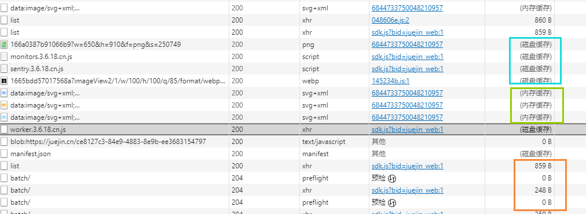
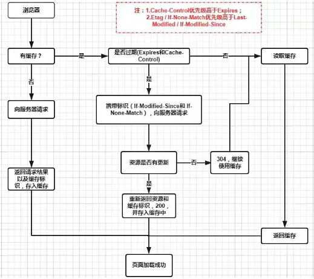
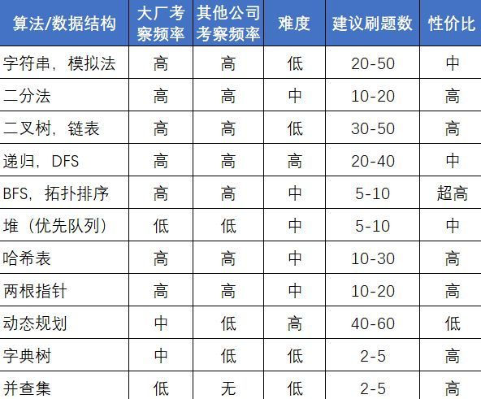
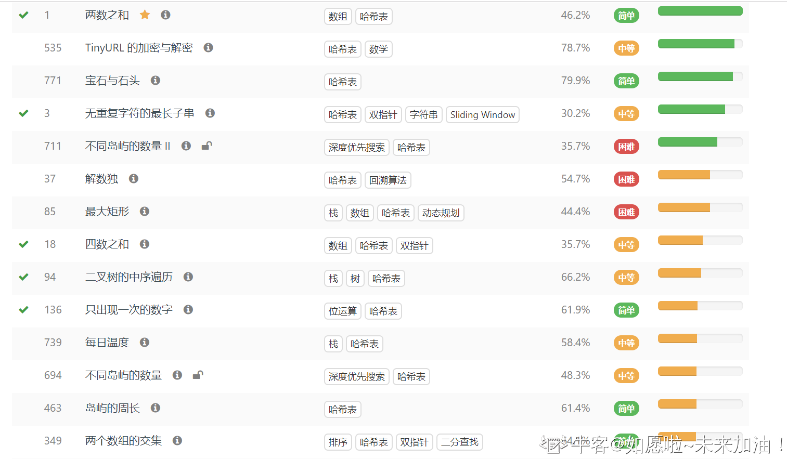

## 前端重难点攻坚指南(updating)

### Contents
------------
- [前端重难点攻坚指南(updating)](#前端重难点攻坚指南updating)
- [### Contents](#-contents)
- [### I. 面试阶段分析](#-i-面试阶段分析)
- [### II. 个人介绍](#-ii-个人介绍)
    - [➣ 重点](#-重点)
    - [➣ 描述在上一家公司的工作经历](#-描述在上一家公司的工作经历)
    - [➣ 范例](#-范例)
- [### III. 要点：HTML/CSS](#-iii-要点htmlcss)
    - [➣ BFC及其应用](#-bfc及其应用)
    - [➣ 两列布局实现](#-两列布局实现)
    - [➣ 1px问题](#-1px问题)
    - [➣ 浮动布局相关](#-浮动布局相关)
    - [➣ 位图和矢量图的区别](#-位图和矢量图的区别)
- [### IV. 要点：Javascript](#-iv-要点javascript)
    - [➣ js类型的判断](#-js类型的判断)
    - [➣ 实现Call和Apply](#-实现call和apply)
    - [➣ 实现对象new操作](#-实现对象new操作)
    - [➣ Js实现继承](#-js实现继承)
    - [➣ 手写深拷贝和浅拷贝](#-手写深拷贝和浅拷贝)
    - [➣ ES6新增特性](#-es6新增特性)
    - [➣ 移动端点击穿透问题](#-移动端点击穿透问题)
    - [➣ 图片懒加载具体实现方案和思路](#-图片懒加载具体实现方案和思路)
    - [➣ 函数防抖和节流实现](#-函数防抖和节流实现)
    - [➣ Js/Node的事件循环(宏任务、微任务)](#-jsnode的事件循环宏任务微任务)
    - [➣ 页面加载会触发哪些事件](#-页面加载会触发哪些事件)
    - [➣ document.ready和window.onload的区别](#-documentready和windowonload的区别)
    - [➣ 闭包Closure](#-闭包closure)
    - [➣ 函数式编程思想的体现](#-函数式编程思想的体现)
    - [➣ vue双向绑定实现原理](#-vue双向绑定实现原理)
    - [➣ Vue2.0与Vue3.0双向绑定，proxy实现](#-vue20与vue30双向绑定proxy实现)
    - [➣ React-Fiber原理](#-react-fiber原理)
    - [➣ React生命周期，React16.3版本后变化，为什么要这样做，有哪些不安全的生命周期（结合React Fiber)](#-react生命周期react163版本后变化为什么要这样做有哪些不安全的生命周期结合react-fiber)
      - [React16.3之前的生命周期](#react163之前的生命周期)
      - [React16.3之后的生命周期](#react163之后的生命周期)
    - [➣ React虚拟dom以及diff算法](#-react虚拟dom以及diff算法)
    - [➣ Babel源码](#-babel源码)
    - [➣ React SetState原理](#-react-setstate原理)
    - [➣ 前端错误监控方法](#-前端错误监控方法)
    - [➣ 实现一个EventEmitter类，支持事件的on,off,emit,once,setMaxListeners。](#-实现一个eventemitter类支持事件的onoffemitoncesetmaxlisteners)
    - [➣ 如何自己实现一个单点登录系统](#-如何自己实现一个单点登录系统)
    - [➣ 使用ES5实现Promise](#-使用es5实现promise)
- [### V. 要点：Node.js](#-v-要点nodejs)
    - [➣ 谈谈node子进程child_process和实际使用场景](#-谈谈node子进程child_process和实际使用场景)
    - [➣ node是IO密集型体现在哪里](#-node是io密集型体现在哪里)
- [### VI. 要点：设计模式](#-vi-要点设计模式)
- [### VII. 要点：前端工具](#-vii-要点前端工具)
    - [➣ 打包gulp/webpack/rollup一些区别](#-打包gulpwebpackrollup一些区别)
    - [➣ ts自己的看法，和应用](#-ts自己的看法和应用)
    - [➣ webpack loader和plugin区别](#-webpack-loader和plugin区别)
    - [➣ webpack中循环引用问题，a里面引用了b，b里面引用了a](#-webpack中循环引用问题a里面引用了bb里面引用了a)
- [### VIII. 要点：前端性能优化](#-viii-要点前端性能优化)
    - [➣ HTML/CSS性能优化方面](#-htmlcss性能优化方面)
      - [1. 网络层面](#1-网络层面)
      - [2. 渲染层面](#2-渲染层面)
    - [➣ Javascript性能优化方面](#-javascript性能优化方面)
      - [网络层面](#网络层面)
      - [渲染层面](#渲染层面)
    - [➣ React性能优化方面](#-react性能优化方面)
      - [网络层面](#网络层面-1)
      - [渲染层面](#渲染层面-1)
    - [➣ webpack性能优化方面](#-webpack性能优化方面)
    - [➣ 服务器性能优化方面](#-服务器性能优化方面)
    - [➣ 弱网环境下页面首屏如何快速加载](#-弱网环境下页面首屏如何快速加载)
- [### IX. 要点：操作系统和网络](#-ix-要点操作系统和网络)
    - [➣ 常见的网页攻击方式，如何防范](#-常见的网页攻击方式如何防范)
      - [1. XSS：跨站脚本攻击(Cross-site scripting)](#1-xss跨站脚本攻击cross-site-scripting)
      - [2. XSRF：跨站请求伪造(Cross-site request forgery)](#2-xsrf跨站请求伪造cross-site-request-forgery)
    - [➣ 跨域的基本概念和解决方法，在项目中的实际应用](#-跨域的基本概念和解决方法在项目中的实际应用)
    - [➣ 强缓存和协商缓存，缓存的应用，如何用在页面性能优化上](#-强缓存和协商缓存缓存的应用如何用在页面性能优化上)
      - [浏览器缓存的工作流程](#浏览器缓存的工作流程)
      - [1. Service-Worker Cache(优先级最高)](#1-service-worker-cache优先级最高)
      - [2. Memory Cache(优先级次之)](#2-memory-cache优先级次之)
      - [3. HTTP Cache(优先级次之)](#3-http-cache优先级次之)
      - [4. Push Cache(优先级最低)](#4-push-cache优先级最低)
    - [➣ 爬虫方面问题，反爬如何实现，针对反爬的实现(IP代理等）](#-爬虫方面问题反爬如何实现针对反爬的实现ip代理等)
    - [➣ 进程和线程区别](#-进程和线程区别)
    - [➣ cpu调度算法](#-cpu调度算法)
    - [➣ 2台计算机底层之间如何通信 socket IO通信实现](#-2台计算机底层之间如何通信-socket-io通信实现)
    - [➣ cookie中常见的字段](#-cookie中常见的字段)
    - [➣ 同源策略](#-同源策略)
    - [➣ http中一些常见的响应头和请求头，有什么应用](#-http中一些常见的响应头和请求头有什么应用)
    - [➣ 简单请求和非简单请求区别](#-简单请求和非简单请求区别)
    - [➣ http2.0 http3.0作了哪些优化](#-http20-http30作了哪些优化)
    - [➣ https建立连接过程](#-https建立连接过程)
    - [➣ 计算机网络中，http地址，在7层协议中，如何一步步向下解析，从应用层到最底层的物理层，每一层处理的事情](#-计算机网络中http地址在7层协议中如何一步步向下解析从应用层到最底层的物理层每一层处理的事情)
- [### X. 要点：Leetcode算法刷题](#-x-要点leetcode算法刷题)
    - [➣ 考察重点](#-考察重点)
    - [➣ 推荐作者和资源](#-推荐作者和资源)

### I. 面试阶段分析
----------

1. 一面主要是针对基础知识，面试官会根据你的简历对各个知识点进行考察，需要有扎实的基础，提升对基础知识的熟悉度。
2. 二面面试官会考察你知识掌握的深入程度，会根据你的个人项目，深挖其中的技术点。比如如果项目中用了React的话可能问你React diff算法、React性能优化等等，所以需要对个人项目所涉及到的技术点有深入研究和理解。
3. 三面四面也会根据你的项目对你提问，需要熟知自己项目的闪光点以及一些尚待优化之处。除此之外面试官可能会出一些实际生产环境下的场景题，考察你的思维逻辑、技术积累和应变能力。

### II. 个人介绍
----------

#### ➣ 重点

1. 我最突出的技能是什么  
例如：Js的多维运用
2. 我在哪方面的知识掌握是最全面的  
例如：前端工程化
3. 我性格上最大的优势是什么  
例如：对技术的热情和对问题孜孜不倦的深挖实践
4. 我最擅长的事情是什么  
例如：擅长从工作中分析总结，制定对某类问题的解决方法，编写效率工具
5. 我有哪些成就和贡献  
...

#### ➣ 描述在上一家公司的工作经历
在前一个公司，我们使用React/Mobx/Node.js/Electron等技术，我主要负责一个存储集群产品的前端开发迭代、中间层维护和通用打包脚本编写这些。也曾担任过一个SMB客户端产品主要开发工作，负责项目搭建、架构优化以及多文件分片上传模块编写。

#### ➣ 范例
面试官，你好，我叫xx，毕业于xx大学xx专业，三年工作经验。在前一个公司主要负责一个存储集群产品的前端开发、中间层维护和通用打包脚本编写这些，也担任过一个SMB客户端产品主要开发工作，负责项目搭建、架构优化以及多文件分片上传模块编写。  
自己比较擅长从日常工作中分析总结，制定对某类问题的解决方法，编写效率工具。  
在技术方面比较熟悉React/Node开发，对前端客户端技术Electron也有涉猎，平时会更新技术博客和Github。


### III. 要点：HTML/CSS
----------

#### ➣ BFC及其应用
```sh
1) BFC 就是块级格式上下文，是页面盒模型布局中的一种 CSS 渲染模式，
相当于一个独立的容器，里面的元素和外部的元素相互不影响。创建 BFC 的方式有：
  html 根元素
　float 浮动
  overflow 不为 visiable
  position值不为static，relative
  display 为Table布局、Flex布局、inline-block、Grid布局

2) BFC 主要的作用是：
  清除浮动（不会和浮动元素重叠）
  防止同一 BFC 容器中的相邻元素间的外边距重叠问题
  多列布局

3) BFC 表现
  内部的Box会在垂直方向上一个接一个放置
  Box垂直方向的距离由margin决定，属于同一个BFC的两个相邻Box的margin会发生重叠
  每个元素的 margin box 的左边，与包含块 border box 的左边相接触
  BFC的区域不会与float box重叠
  BFC是页面上的一个隔离的独立容器，容器里面的子元素不会影响到外面的元素
  计算BFC的高度时，浮动元素也会参与计算

```
#### ➣ 两列布局实现
```sh
1) 使用float浮动元素同时设置元素宽度为100/列数 %
2) 使用inline-block实现方式同1
2) 使用css属性column-count实现
```
#### ➣ 1px问题
1. 涉及到css像素比 device pixel/css pixel = devicePixelRatio(DPR)  
2. 解决方法一  
伪元素设置height模拟边框：
```js
  .setBorderAll{
     position: relative;
       &:after{
           content:" ";
           position:absolute;
           top: 0;
           left: 0;
           width: 200%;
           height: 200%;
           transform: scale(0.5);
           transform-origin: left top;
           box-sizing: border-box;
           border: 1px solid #E5E5E5;
           border-radius: 4px;
      }
    }
  }
```
3. 解决方法二  
设置盒子阴影：
```css
  box-shadow: 0  -1px 1px -1px #e5e5e5,   //上边线
            1px  0  1px -1px #e5e5e5,   //右边线
            0  1px  1px -1px #e5e5e5,   //下边线
            -1px 0  1px -1px #e5e5e5;   //左边线
```
#### ➣ 浮动布局相关
1. 清除浮动的属性  
浮动元素尾部那个不跟随浮动的元素设置`clear:both`
2. 撑起浮动容器元素的方法一  
在浮动元素的最后插入一个声明了`clear:both`的块级元素
3. 撑起浮动容器元素的方法二  
在浮动容器元素后使用伪元素：
```css
  .container:after {
    content: '.';
    height: 0;
    display: block;
    clear: both;
  }
```
4. 撑起浮动容器元素的方法三  
利用BFC特性，设置浮动容器元素的`overflow`不为visible

#### ➣ 位图和矢量图的区别
1. 位图也叫像素图，每个点可以用二进制描述颜色和亮度信息，色彩表现丰富，占用空间大，缩放失真
2. 矢量图使用计算机指令绘制而成，由点线面构成，色彩不丰富，占用空间小，缩放不失真

### IV. 要点：Javascript
----------

#### ➣ js类型的判断
```js
/*
基础类型：string/boolean/number/null/undefined/symbol
引用类型：function/object(date|regexp|obj)/array
*/
function getTypeOf(data) {
  if (data !== data) return 'nan';
  switch(Object.prototype.toString.call(data)) {
    case '[object Null]':
      return 'null';
    case '[object Array]':
      return 'array';
    case '[object Object]':
      return 'object';
    case '[object RegExp]':
      return 'regexp';
    case '[object Date]':
      return 'date';
    default:
      return (typeof data);
  }
}
```
#### ➣ 实现Call和Apply
```js
Function.prototype.myCall = function(context) {
  var args, result, symbol;

  context = Object(context) || window;
  args = Array.prototype.slice.call(arguments, 1);
  symbol = Symbol('myCall');
  context[symbol] = this;
  // 如果不使用扩展运算符的话可以将args[i]转换成逗号分隔的字符串
  // 然后通过eval('context.fn('+ argstr +')')获取结果
  result = context[symbol](...args);
  delete context[symbol];

  return result;
};

Function.prototype.myApply = function(context, args) {
  var result, symbol;

  args = args || [];
  context = Object(context) || window;
  if (!(args instanceof Array)) throw new Error('The args of apply must be an array.');

  symbol = Symbol('myApply');
  context[symbol] = this;
  result = context[symbol](...args);
  delete context[symbol];

  return result;
};

```
#### ➣ 实现对象new操作
```sh
function New(func) {
  var empty = Object.create(null);
  var args = Array.prototype.slice.call(arguments, 1);
  func.apply(empty, args);
  empty.__proto__ = func.prototype;
  return empty;
}
```
#### ➣ Js实现继承
```sh
function Inherit (parent, child) {
  function Empty() {};
  Empty.prototype = parent.prototype;
  var empty = new Empty();
  empty.constructor = child;
  child.prototype = empty;
}

function Parent(parent) {
  this.p_attr = parent;
}

Parent.prototype.p_print = function() {
  console.log(this.p_attr);
}

function Child(attr) {
  Parent.call(this, 'parent');
  this.c_attr = attr;
  this.print = function() {
    console.log(this.c_attr);
  }
}

Inherit(Parent, Child);

var child = new Child('child');

child.print();
child.p_print();
```
#### ➣ 手写深拷贝和浅拷贝
<details>
<summary>点击展开查看</summary>

```js
/* 深拷贝 */
function deepClone(data) {

  const map = new WeakMap();
  
  const isObjType = (obj, type) => {
    if (typeof obj !== 'object') return false;
    return Object.prototype.toString.call(obj) === `[object ${type}]`;
  };

  const _clone = (target) => {
    if (target === null) return null;
    if (target !== target) return NaN;
    if (typeof target !== 'object') return target;
    
    let base;

    // 对正则对象做特殊处理
    if (isObjType(target, 'RegExp')) return new RegExp(target.source, target.flags);
    // 对Date对象做特殊处理
    if (isObjType(target, 'Date')) return new Date(target.getTime());

    base = isObjType(target, 'Array') ? [] : {};

    // 处理循环引用
    if (map.get(target)) return map.get(target);
    map.set(target, base);
    
    for (let i in target) {
      if (Object.prototype.hasOwnProperty.call(target, i)) {
        base[i] = _clone(target[i]);
      }
    }
    
    return base;
  };

  return _clone(data);
};

/* 浅拷贝 */
function shallowClone(data) {
  let base;

  if (!data || !(typeof data === 'object')) {
    return data;
  } else {
    base = Object.prototype.toString.call(data) === '[object Array]' ? [] : {};
  }

  for (let attr in data) {
    if (Object.prototype.hasOwnProperty.call(data, attr)) {
      base[attr] = data[attr];
    }
  }

  return base;
}

```
</details>

#### ➣ ES6新增特性

1. Promise
2. let/const/块级作用域
3. Arrow Function、函数默认参数、数组、对象、函数返回值的解构
4. Map/WeakMap/Set/WeakSet
5. ES6 Class
6. 字符串方法扩展repeat/trim/includes/startsWith/endsWith/padStart/padEnd
7. 数组方法扩展find/findIndex/fill/includes
8. Array.from将类数组和实现了迭代器的对象转换成数组
9. Array.of将一个或多个值转换成数组

#### ➣ 移动端点击穿透问题
1. 问题来源  
移动浏览器提供一个特殊的功能：双击(double tap)放大，300ms的延迟就来自这里，用户碰触页面之后，需要等待一段时间来判断是不是双击动作，而不是立即响应单击（click），等待的这段时间大约是300ms。为了消除延迟，我们使用touch start / touch end 事件来模拟click事件，这便是造成点击穿透问题的原因，想象一个场景：mask蒙层有个绑定touch start事件的关闭按钮，点击之后蒙层消失，之后300ms后点击位置触发click事件，导致mask下面的元素被误触。
2. 问题解决  
1）界面统一使用touch事件替代click事件  
2）界面只click事件(会造成300ms延迟)  
3）mask隐藏后，给按钮下面元素添上`pointer-events: none`(会造成元素短时间无法响应)  
4）使用外部框架`fastclick`解决  
#### ➣ 图片懒加载具体实现方案和思路  
使用监听器IntersectionObserver来监听界面滚动，当被监听元素处于视口可见区域时，设置图片元素的src为真实的地址。如果不使用这个API的话需要手动监听页面滚动然后通过计算img元素的`offsetTop < document.documentElement.clientHeight + (document.documentElement.scrollTop || document.body.scrollTop)` 来判断元素进入视区实现，并注意配合防抖函数进行优化。
```js
(function lazyLoad(){
    const imageToLazy = document.querySelectorAll('img[data-src]');
    const loadImage = function (image) {
        image.setAttribute('src', image.getAttribute('data-src'));
        image.addEventListener('load', function() {
            image.removeAttribute("data-src");
        })
    }

    const intersectionObserver = new IntersectionObserver(function(items, observer) {
        items.forEach(function(item) {
            if(item.isIntersecting) {
                loadImage(item.target);
                observer.unobserve(item.target);
            }
        });
    });

    imageToLazy.forEach(function(image){
        intersectionObserver.observe(image);
    })
})()
```
#### ➣ 函数防抖和节流实现
```js
/* 去抖 */
function debounce(fn, time) {
  let timer;

  return function() {
    clearTimeout(timer);
    timer = setTimeout(() => {
      fn.apply(this, arguments);
    }, time);
  }
}

/* 节流 */
function throttle(fn, time) {
  let canRun = true;

  return function() {
    if (canRun) {
      canRun = false;
      setTimeout(() => {
        fn.apply(this, arguments);
        canRun = true;
      }, time)
    }
  }
}
```
#### ➣ Js/Node的事件循环(宏任务、微任务)

#### ➣ 页面加载会触发哪些事件
<details>
<summary>点击展开查看</summary>

1. document readystatechange事件  
readyState 属性描述了文档的加载状态，在整个加载过程中document.readyState会不断变化，每次变化都会触发readystatechange事件。事件使用`document.onreadystatechange`进行监听。  
readyState 有以下状态：  
  _1）loading - document仍在加载。_  
  _2）interactive - 文档结构已经完成加载，文档已被解析并且可以交互，但是诸如图像，样式表和脚本之类的外部资源仍在加载_  
  _3）complete - 文档和所有外部资源已完成加载。_  
2. document DOMContentLoaded事件  
  DOM树渲染完成时触发DOMContentLoaded事件，此时可能外部资源还在加载，事件同于jQuery中的ready事件和`readyState == 'interactive'`阶段。事件使用`document.addEventListener('DOMContentLoaded', function)`监听。
3. window load事件  
  所有的资源全部加载完成会触发window的load事件。事件使用`window.onload=function`进行监听。
```js
switch (document.readyState) {
  case "loading":
    // 表示文档还在加载中，即处于“正在加载”状态。
    break;
  case "interactive":
    // 文档已经结束了“正在加载”状态，DOM元素可以被访问
    break;
  case "complete":
    // 页面所有内容都已被完全加载.
    break;
}
/* 模拟 原生DOMContentLoaded 和 jquery ready 事件 */
document.onreadystatechange = function () {
  if (document.readyState === "interactive") {
    initApplication();
  }
}

/* 模拟 window.onload 事件 */
document.onreadystatechange = function () {
  if (document.readyState === "complete") {
    initApplication();
  }
}
```
</details>

#### ➣ document.ready和window.onload的区别  
```sh
ready事件在DOM结构绘制完成之后就会执行，这样能确保就算有大量的媒体文件没加载出来，JS代码一样可以执行。
load事件必须等到网页中所有内容全部加载完毕之后才被执行，如果一个网页中有大量的图片的话，则就会出现这种情况：网页文档已经呈现出来，但由于网页数据还没有完全加载完毕，导致load事件不能够即时被触发。
```
#### ➣ 闭包Closure  
<details>
<summary>点击展开查看</summary>

1. 执行上下文  
函数每次执行，都会生成一个执行上下文内部对象(可理解为函数作用域)，这个上下文对象会保存函数中所有的变量值和该函数内部定义的函数的引用。函数每次执行时对应的执行上下文都是独一无二的，正常情况下函数执行完毕执行上下文就会被销毁。  
2. 内部作用域的外部引用导致作用域内变量垃圾回收不执行  
当一个函数内部作用域(注意不是单纯的变量引用)被其外层作用域引用时，函数执行完之后，其执行上下文不会被销毁，我们还能沿着作用域链访问到某个被引用的内部变量。
```js
// 外层作用域
function counterCreator() {
  // 内层作用域1
  var index = 1;
  return function () {
    // 内层作用域2，引用作用域1的变量index
    return index ++;
  };
}

// 外层作用域通过作用域链保存了内层作用域1的变量引用
var counterA = counterCreator();
// index变量不会被垃圾回收
counterA();     // 1
counterA();     // 2

```

</details>

#### ➣ 函数式编程思想的体现

#### ➣ vue双向绑定实现原理

#### ➣ Vue2.0与Vue3.0双向绑定，proxy实现

#### ➣ React-Fiber原理

<details>
<summary>点击展开查看</summary>

1. \> React架构  
  - 1）Virtual DOM 层，描述页面长什么样  
  - 2）Reconciler 层，负责调用组件生命周期方法，进行 Diff 运算-等  
  - 3）Renderer 层，根据不同的平台，渲染出相应的页面，如ReactDOM和ReactNative

2. \> React15遗留问题  

  - 1）浏览器的整体渲染是多线程的，包括GUI渲染线程、JS引擎线程、事件触发线程、定时触发器线程和异步http请求线程。页面绘制和JS运算是互斥的线程，两者不能同时进行。  
  - 2）React15使用JS的函数调用栈(Stack Reconciler)递归渲染界面，因此在处理DOM元素过多的复杂页面的频繁更新时，大量同步进行的任务(树diff和页面render)会导致界面更新阻塞、事件响应延迟、动画卡顿等，因此React团队在16版本重写了React Reconciler架构。

3. \> React16问题解决  

 - 1）`Fiber Reconciler`架构可以允许同步阻塞的任务拆分成多个小任务，每个任务占用一小段时间片，任务执行完成后判断有无空闲时间，有则继续执行下一个任务，否则将控制权交由浏览器以让浏览器去处理更高优先级的任务，等下次拿到时间片后，其它子任务继续执行。整个流程类似CPU调度逻辑，底层是使用了浏览器API`requestIdleCallback`。  
- 2）为了实现整个Diff和Render的流程可中断和恢复，单纯的VirtualDom Tree不再满足需求，React16引入了采用单链表结构的Fiber树，如下图所示。
- 3）FiberReconciler架构将更新流程划分成了两个阶段：1.diff(由多个diff任务组成，任务时间片消耗完后被可被中断，中断后由requestIdleCallback再次唤醒) => 2.commit(diff完毕后拿到fiber tree更新结果触发DOM渲染，不可被中断)。左边灰色部分的树即为一颗fiber树，右边的workInProgress为中间态，它是在diff过程中自顶向下构建的树形结构，可用于断点恢复，所有工作单元都更新完成之后，生成的workInProgress树会成为新的fiber tree。
- 4）fiber tree中每个节点即一个工作单元，跟之前的VirtualDom树类似，表示一个虚拟DOM节点。workInProgress tree的每个fiber node都保存着diff过程中产生的effect list，它用来存放diff结果，并且底层的树节点会依次向上层merge effect list，以收集所有diff结果。注意的是如果某些节点并未更新，workInProgress tree会直接复用原fiber tree的节点(链表操作)，而有数据更新的节点会被打上tag标签。
```js
<FiberNode> : {
    stateNode,    // 节点实例
    child,        // 子节点
    sibling,      // 兄弟节点
    return,       // 父节点
}
```  


</details>

#### ➣ React生命周期，React16.3版本后变化，为什么要这样做，有哪些不安全的生命周期（结合React Fiber)

<details>
<summary>点击展开查看</summary>

##### React16.3之前的生命周期


1. componentWillMount()  
此生命周期函数会在在组件挂载之前被调用，整个生命周期中只被触发一次。开发者通常用来进行一些数据的预请求操作，以减少请求发起时间，建议的替代方案是考虑放入constructor构造函数中，或者componentDidMount后；另一种情况是在在使用了外部状态管理库时，如Mobx，可以用于重置Mobx Store中的的已保存数据，替代方案是使用生命周期componentWilUnmount在组件卸载时自动执行数据清理。

2. componentDidMount()  
此生命周期函数在组件被挂载之后被调用，整个生命周期中只触发一次。开发者同样可以用来进行一些数据请求的操作；除此之外也可用于添加事件订阅(需要在componentWillUnmount中取消事件订阅)；因为函数触发时dom元素已经渲染完毕，第三种使用情况是处理一些界面更新的副作用，比如使用默认数据来初始化一个echarts组件，然后在componentDidUpdate后进行echarts组件的数据更新。

3. componentWillReceiveProps(nextProps, nexState)  
此生命周期发生在组件挂载之后的组件更新阶段。最常见于在一个依赖于prop属性进行组件内部state更新的非完全受控组件中，非完全受控组件即组件内部维护state更新，同时又在某个特殊条件下会采用外部传入的props来更新内部state，注意不要直接将props完全复制到state，否则应该使用完全受控组件`Function Component`，一个例子如下：
```js
class EmailInput extends Component {
  state = { email: this.props.email };

  render() {
    return <input onChange={this.handleChange} value={this.state.email} />;
  }

  handleChange = e => his.setState({ email: e.target.value });

  componentWillReceiveProps(nextProps) {
    if (nextProps.userID !== this.props.userID) {
      this.setState({ email: nextProps.email });
    }
  }
}
```

4. shouldComponentUpdate(nextProps)  
此生命周期发生在组件挂载之后的组件更新阶段。  
值得注意的是子组件更新不一定是由于props或state改变引起的，也可能是父组件的其它部分更改导致父组件重渲染而使得当前子组件在props/state未改变的情况下重新渲染一次。  
函数被调用时会被传入即将更新的`nextProps`和`nextState`对象，开发者可以通过对比前后两个props对象上与界面渲染相关的属性是否改变，再决定是否允许这次更新(return `true`表示允许执行更新，否则忽略更新，默认为`true`)。常搭配对象深比较函数用于减少界面无用渲染次数，优化性能。在一些只需要简单浅比较props变化的场景下，并且相同的state和props会渲染出相同的内容时，建议使用`React.PureComponnet`替代，在props更新时React会自动帮你进行一次浅比较，以减少不必要渲染。
```js
class EmailInput extends Component {
  state = { email: this.props.email };

  render() {
    return <input onChange={this.handleChange} value={this.state.email} />;
  }

  handleChange = e => his.setState({ email: e.target.value });

  shouldComponentUpdate(nextProps, nextState) {
    if (
      nextProps.userID === this.props.userID &&
      nextState.email == this.state.email
    ) return false;
  }
}
```

5. componenetWillUpdate(newProps, newState)  
此生命周期发生在组件挂载之后的更新阶段。当组件收到新的props或state，并且`shouldComponentUpdate`返回允许更新时，会在渲染之前调此方法，不可以在此生命周期执行`setState`。在此生命周期中开发者可以在界面实际渲染更新之前拿到最新的`nextProps`和`nextState`，从而执行一些副作用：比如触发一个事件、根据最新的props缓存一些计算数据到组件内、平滑界面元素动画等：
```js
 // 需要搭配css属性transition使用
 componentWillUpdate : function(newProps,newState){
    if(!newState.show)
      $(ReactDOM.findDOMNode(this.refs.elem)).css({'opacity':'1'});
    else
      $(ReactDOM.findDOMNode(this.refs.elem)).css({'opacity':'0'});;
  },
  componentDidUpdate : function(oldProps,oldState){
    if(this.state.show)
      $(ReactDOM.findDOMNode(this.refs.elem)).css({'opacity':'1'});
    else
      $(ReactDOM.findDOMNode(this.refs.elem)).css({'opacity':'0'});;
  }
```

6. componenetDidUpdate(prevProps, prevState)  
此生命周期发生在组件挂载之后的更新阶段，组件初次挂载不会触发。当组件的props和state改变引起界面渲染更新后，此函数会被调用，不可以在此生命周期执行`setState`。我们使用它用来执行一些副作用：比如条件式触发必要的网络请求来更新本地数据、使用render后的最新数据来调用一些外部库的执行(例子：定时器请求接口数据动态绘制echarts折线图)：
```js
  ...
  componentDidMount() {
    this.echartsElement = echarts.init(this.refs.echart);
    this.echartsElement.setOption(this.props.defaultData);
    ...
  }
  componentDidUpdate() {
    const { treeData } = this.props;
    const optionData = this.echartsElement.getOption();
    optionData.series[0].data = [treeData];
    this.echartsElement.setOption(optionData, true);
  }
```


7. componentWillUnmount()  
此生命周期发生在组件卸载之前，组件生命周期中只会触发一次。开发者可以在此函数中执行一些数据清理重置、取消页面组件的事件订阅等。

##### React16.3之后的生命周期


React16.3之后React的`Reconciler`架构被重写(Reconciler用于处理生命周期钩子函数和DOM DIFF)，之前版本采用函数调用栈递归同步渲染机制即Stack Reconciler，dom的diff阶段不能被打断，所以不利于动画执行和事件响应。React团队使用Fiber Reconciler架构之后，diff阶段根据虚拟DOM节点拆分成包含多个工作任务单元(FiberNode)的Fiber树(以链表实现)，实现了Fiber任务单元之间的任意切换和任务之间的打断及恢复等等。Fiber架构下的异步渲染导致了`componentWillMount`、`componentWillReceiveProps`、`componentWillUpdate`三个生命周期在实际渲染之前可能会被调用多次，产生不可预料的调用结果，因此这三个不安全生命周期函数不建议被使用。取而代之的是使用全新的两个生命周期函数：`getDerivedStateFromProps`和`getSnapshotBeforeUpdate`。

1. __getDerivedStateFromProps(nextProps, currentState)__  
- 1）定义  
此生命周期发生在组件初始化挂载和组件更新阶段，开发者可以用它来替代之前的`componentWillReceiveProps`生命周期，可用于根据props变化来动态设置组件内部state。  
函数为static静态函数，因此我们无法使用`this`直接访问组件实例，也无法使用`this.setState`直接对state进行更改，以此可以看出React团队想通过React框架的API式约束来尽量减少开发者的API滥用。函数调用时会被传入即将更新的props和当前组件的state数据作为参数，我们可以通过对比处理props然后返回一个对象来触发的组件state更新，如果返回null则不更新任何内容。  
- 2）滥用场景一：直接复制props到state上面  
这会导致父层级重新渲染时，SimpleInput组件的state都会被重置为父组件重新传入的props，不管props是否发生了改变。如果你说使用`shouldComponentUpdate`搭配着避免这种情况可以吗？代码层面上可以，不过可能导致后期`shouldComponentUpdate`函数的数据来源混乱，任何一个prop的改变都会导致重新渲染和不正确的状态重置，维护一个可靠的`shouldComponentUpdate`会更难。
```js
class SimpleInput extends Component {
  state = { attr: ''  };

  render() {
    return <input onChange={(e) => this.setState({ attr: e.target.value })} value={this.state.attr} />;
  }

  static getDerivedStateFromProps(nextProps, currentState) {
    // 这会覆盖所有组件内的state更新！
    return { attr: nextProps.attr };
  }
}
```

- 3）使用场景： 在props变化后选择性修改state  
```js
class SimpleInput extends Component {
  state = { attr: ''  };

  render() {
    return <input onChange={(e) => this.setState({ attr: e.target.value })} value={this.state.attr} />;
  }

  static getDerivedStateFromProps(nextProps, currentState) {
    if (nextProps.attr !== currentState.attr) return { attr: nextProps.attr };
    return null;
  }
}
```
可能导致的bug：在需要重置SimpleInput组件的情况下，由于`props.attr`未改变，导致组件无法正确重置状态，表现就是input输入框组件的值还是上次遗留的输入。

- 4）优化的使用场景一：使用完全可控的组件  
完全可控的组件即没有内部状态的功能组件，其状态的改变完全受父级props控制，这种方式需要将原本位于组件内的state和改变state的逻辑方法抽离到父级。适用于一些简单的场景，不过如果父级存在太多的子级状态管理逻辑也会使逻辑冗余复杂化。
```js
function SimpleInput(props) {
  return <input onChange={props.onChange} value={props.attr} />;
}
```
- 5）优化的使用场景二：使用有key值的完全可控的组件  
如果我们想让组件拥有自己的状态管理逻辑，但是在适当的条件下我们又可以控制组件以新的默认值重新初始化，这里有几种方法参考：
```js
/* 
  1. 设置一个唯一值传入作为组件重新初始化的标志
     通过对比属性手动让组件重新初始化
*/
class SimpleInput extends Component {
  state = { attr: this.props.attr, id=""  }; // 初始化默认值

  render() {
    return <input onChange={(e) => this.setState({ attr: e.target.value })} value={this.state.attr} />;
  }

  static getDerivedStateFromProps(nextProps, currentState) {
    if (nextProps.id !== currentState.id)
      return { attr: nextProps.attr, id: nextProps.id };
    return null;
  }
}

/*
  2. 设置一个唯一值作为组件的key值
     key值改变后组件会以默认值重新初始化
  */
class SimpleInput extends Component {
  state = { attr: this.props.attr  }; // 初始化默认值

  render() {
    return <input onChange={(e) => this.setState({ attr: e.target.value })} value={this.state.attr} />;
  }
}

<SimpleInput
  attr={this.props.attr}
  key={this.props.id}
/>

/*
  3. 提供一个外部调用函数以供父级直接调用以重置组件状态
     父级通过refs来访问组件实例，拿到组件的内部方法进行调用
  */
class SimpleInput extends Component {
  state = { attr: this.props.attr  }; // 初始化默认值

  resetState = (value) => {
    this.setState({ attr: value });
  }

  render() {
    return <input onChange={(e) => this.setState({ attr: e.target.value })} value={this.state.attr} />;
  }
}

<SimpleInput
  attr={this.props.attr}
  ref={this.simpleInput}
/>


```


2. componentDidMount()  
...

3. shouldComponentUpdate(nextProps, nexState)  
...

4. getSnapshotBeforeUpdate(prevProps, prevState)  
此生命周期发生在组件初始化挂载和组件更新阶段，界面实际render之前。开发者可以拿到组件更新前的`prevProps`和`prevState`，同时也能获取到dom渲染之前的状态(比如元素宽高、滚动条长度和位置等等)。此函数的返回值会被作为`componentWillUpdate`周期函数的第三个参数传入，通过搭配`componentDidUpdate`可以完全替代之前`componentWillUpdate`部分的逻辑，见以下示例。  
```js
class ScrollingList extends Component {
  constructor(props) {
    super(props);
    this.listRef = React.createRef();
  }

  getSnapshotBeforeUpdate(prevProps, prevState) {
    // 判断是否在list中添加新的items 
    // 捕获滚动​​位置以便我们稍后调整滚动位置。
    if (prevProps.list.length < this.props.list.length) {
      const list = this.listRef.current;
      return list.scrollHeight - list.scrollTop;
    }
    return null;
  }

  componentDidUpdate(prevProps, prevState, snapshot) {
    // 调整滚动位置使得这些新items不会将旧的items推出视图
    // snapshot是getSnapshotBeforeUpdate的返回值）
    if (snapshot !== null) {
      const list = this.listRef.current;
      list.scrollTop = list.scrollHeight - snapshot;
    }
  }

  render() {
    return (
      <div ref={this.listRef}>{/* ...list items... */}</div>
    );
  }
}
```

5. componenetDidUpdate(prevProps, prevState, shot)  
此生命周期新增特性：`getSnapshotBeforeUpdate`的返回值作为此函数执行时传入的第三个参数。

6. componenetWillUnmount  
...

</details>

#### ➣ React虚拟dom以及diff算法

#### ➣ Babel源码

#### ➣ React SetState原理

#### ➣ 前端错误监控方法

#### ➣ 实现一个EventEmitter类，支持事件的on,off,emit,once,setMaxListeners。
<details>
<summary>点击展开查看</summary>

```js
function EventEmitter() {
  this.maxListeners = 100;
  this.listeners = {};
  this.onceMap = {};
}

EventEmitter.prototype.setMaxListeners = function(num) {
  if (typeof num !== 'number' || !Number.isInteger(num) || num <= 0)
    throw new Error('setMaxListeners #### ➣ param num must be a positive integer!');
  this.maxListeners = num;
}

EventEmitter.prototype.on = function(type, func) {
  if (!type || !func instanceof Function) return;
  if (this.listeners[type]) {
    if (this.listeners[type].length > this.maxListeners) 
      return console.error('The max listeners limitation: ', this.maxListeners);
    this.listeners[type].push(func);
  } else {
    this.listeners[type] = [func];
  }
  this.onceMap[type] = false;
}

EventEmitter.prototype.once = function(type, func) {
  if (!type || !func instanceof Function) return;
  this.on(type, func);
  this.onceMap[type] = true;
}

EventEmitter.prototype.off = function(type, func) {
  if (!type || !func) return;
  if (this.listeners[type]) {
    this.listeners[type] =
      this.listeners[type].filter(function(fn) { return fn !== func; });
  }
}

EventEmitter.prototype.emit = function(type) {
  (this.listeners[type] || []).forEach(function(fn) {
    fn();
  });
  if (this.onceMap[type]) delete this.listeners[type];
  delete this.onceMap[type];
}
```
</details>

#### ➣ 如何自己实现一个单点登录系统

#### ➣ 使用ES5实现Promise  
[链接-> 使用ES5实现ES6 Promise API](https://github.com/nojsja/promise-nojsja)

### V. 要点：Node.js
----------

#### ➣ 谈谈node子进程child_process和实际使用场景

#### ➣ node是IO密集型体现在哪里

### VI. 要点：设计模式
----------

1. [策略模式](https://github.com/nojsja/javascript-learning/tree/master/design-patterns#1-the-strategy-pattern%E7%AD%96%E7%95%A5%E6%A8%A1%E5%BC%8F)

2. [观察者模式](https://github.com/nojsja/javascript-learning/tree/master/design-patterns#2-the-observer-pattern%E8%A7%82%E5%AF%9F%E8%80%85%E6%A8%A1%E5%BC%8F)

3. [享元模式](https://github.com/nojsja/javascript-learning/tree/master/design-patterns#3-the-flyweight-pattern%E4%BA%AB%E5%85%83%E6%A8%A1%E5%BC%8F)

4. [装饰者模式](https://github.com/nojsja/javascript-learning/tree/master/design-patterns#4-the-decorator-pattern%E8%A3%85%E9%A5%B0%E8%80%85%E6%A8%A1%E5%BC%8F)

5. [代理模式](https://github.com/nojsja/javascript-learning/tree/master/design-patterns#5-the-proxy-pattern%E4%BB%A3%E7%90%86%E6%A8%A1%E5%BC%8F)

6. [状态模式](https://github.com/nojsja/javascript-learning/tree/master/design-patterns#6-the-state-pattern%E7%8A%B6%E6%80%81%E6%A8%A1%E5%BC%8F)

7. [责任链模式](https://github.com/nojsja/javascript-learning/tree/master/design-patterns#7-the-responsibility-chain-pattern%E8%B4%A3%E4%BB%BB%E9%93%BE%E6%A8%A1%E5%BC%8F)

8. [模板方法模式](https://github.com/nojsja/javascript-learning/tree/master/design-patterns#7-the-responsibility-chain-pattern%E8%B4%A3%E4%BB%BB%E9%93%BE%E6%A8%A1%E5%BC%8F)

### VII. 要点：前端工具
---------

#### ➣ 打包gulp/webpack/rollup一些区别

#### ➣ ts自己的看法，和应用

#### ➣ webpack loader和plugin区别

#### ➣ webpack中循环引用问题，a里面引用了b，b里面引用了a


### VIII. 要点：前端性能优化
--------


&nbsp;&nbsp;&nbsp;&nbsp; 前端性能优化是个很大的概念，涉及HTTP协议、浏览器渲染原理、操作系统和网络、前端工程化和Js底层原理等各个方面。通过建立思维导图可以让我们很好的将各个优化方面组织和联系起来。  
&nbsp;&nbsp;&nbsp;&nbsp; 按照优化原理的不同则可以将其分为`网络层面优化`和`渲染层面`的优化，网络层面的优化更多体现在资源加载时的优化，而渲染层的优化更多体现在运行时优化。  
&nbsp;&nbsp;&nbsp;&nbsp; 例如优化浏览器缓存策略以减少HTTP请求传输量、图片和其它静态资源的压缩、服务器端启用Gzip压缩、使用CDN、图片懒加载、延迟脚本Defer和异步脚本Async等属于网络层面的优化。另一方面，减少页面的回流和重绘、使用React.Fragment减少界面dom层级、使用骨架屏、函数节流和去抖、React长列表组件优化、通过事件冒泡机制实现事件委托等就属于渲染层面的优化。

#### ➣ HTML/CSS性能优化方面

##### 1. 网络层面

- 1）抽离内联样式内联脚本
  - 内联资源不利于浏览器缓存，造成重复的资源请求
  - 内联资源会造成HTML臃肿，不利于HTTP传输
  - 内联资源的下载和解析可能会阻塞导致界面渲染，导致界面白屏
  - 内联资源不好管理和维护

- 2）defer脚本和async脚本  
  &nbsp;&nbsp;&nbsp;&nbsp; HTML在解析时遇到声明的`<script>`脚本会立即下载和执行，往往会延迟界面剩余部分的解析，造成界面白屏的情况。比较古老的优化方式之一就是将脚本放到HTML文档末尾，这样子解决了白屏的问题，可是在DOM文档结构复杂冗长时，也会造成一定的界面脚本下载和执行延迟，script标签新属性`async`和`defer`可以解决此类问题：
  - defer脚本  
  延迟脚本-声明`defer`属性的外部`<script>`脚本下载时不会阻塞HTML的解析和渲染，并且会在HTML渲染完成并且可实际操作之后开始执行(`DOMContentLoaded`事件被触发之前)，各个脚本解析执行顺序对应声明时的位置顺序，执行完成后会触发页面`DOMContentLoaded`事件。
  - async脚本  
  异步脚本-声明`async`属性的外部`<script>`脚本下载时不会阻塞HTML的解析和渲染，各个脚本的下载和执行完全独立，下载完成后即开始执行，所以执行顺序不固定，与`DOMContentLoaded`事件的触发没有关联性。
  - 动态脚本加载技术  
  在脚本执行时动态运行`loadScript`函数可以实现类似延迟脚本和异步脚本的效果：`isDefer`为真值时脚本的执行顺序为脚本位置顺序，为假值时效果同于异步脚本。
  ```js
    function loadScript(src, isDefer) {
      let script = document.createElement('script');
      script.src = src;
      script.async = !isDefer;
      document.body.append(script);
    }
  ```

- 3）压缩HTML/CSS代码资源  
&nbsp;&nbsp;&nbsp;&nbsp; 代码资源中存在很多无用的空格和符号等，去除他们带来的效益是可观的，另一方面压缩资源也能起到源代码保护的作用。现代前端工程化框架一般继承了此类压缩插件，比如webpack框架的`uglifyjs`插件。

- 4）压缩图片/音视频等多媒体资源  
&nbsp;&nbsp;&nbsp;&nbsp; 其实网页带宽往往被图片等资源大量占用，压缩他们能带来超出预期的优化效益。现代前端工程化框架一般继承了此类压缩插件，如`imagemin-webpack-plugin`插件。

- 5）使用雪碧图  
&nbsp;&nbsp;&nbsp;&nbsp; 使用雪碧图本质上优化了HTTP请求的数量，将众多图片拼贴为一张作为背景图片引用，然后我们给一个元素设置固定大小，让它的背景图片位置进行变化，就好像显示出了不同的图片，这就是雪碧图的原理。

- 6）避免空的 src 和 href 值  
&nbsp;&nbsp;&nbsp;&nbsp; 当link标签的href属性为空、script标签的src属性为空的时候，浏览器渲染的时候会把当前页面的URL作为它们的属性值，从而把页面的内容加载进来作为它们的值。

- 7）避免使用`@import`来引入css，这种语法会阻止多个css文件的并行下载，被`@import`引入的css文件会在引入它的css文件下载并渲染好之后才开始下载渲染自身。并且`@import`引入的css文件的下载顺序会被打乱，排列在`@import`之后的JS文件会先于`@import`下载。

##### 2. 渲染层面

- 1）减少页面的回流和重绘
  - 使用CSS3属性`transform`来实现元素位移
  - 让动画效果应用到`position: fixed/absolute`的元素上，原理是让其脱离文档流
  - 向界面插入大量dom节点时先将dom元素添加到虚拟dom操作节点`DocumentFragment`上，最后再将虚拟节点实际添加到界面上。
  - 避免直接使用JS操作dom元素的style样式，可以使用class一次性改变dom样式类。
  - 将会引起页面回流、重绘的操作尽量放到DOM树的后面，减少级联反应。
  - 使用CSS3动画Animation来实现一些复杂元素的动画效果，原理是利用了硬件加速
  - 读取一些容易引起回流的元素属性注意使用变量缓存
  ```html
  <!-- 几何属性相关 -->
  elem.offsetLeft, elem.offsetTop, elem.offsetWidth, elem.offsetHeight, elem.offsetParent
  elem.clientLeft, elem.clientTop, elem.clientWidth, elem.clientHeight elem.getClientRects(), elem.getBoundingClientRect()
  <!-- 滚动相关 -->
  elem.scrollBy(), elem.scrollTo()
  elem.scrollIntoView(), elem.scrollIntoViewIfNeeded()
  elem.scrollWidth, elem.scrollHeight
  elem.scrollLeft, elem.scrollTop 除了读取，设置也会触发
  ...
  ```
- 2）减少DOM结构的层级
- 3）尽量不使用`table`布局和`iframe`内联网页
  ```js
  /* table布局 */
  table布局不灵活，不利于css样式定制
  table布局渲染性能较低，可能触发多次重绘
  table布局不利于html语义化

  /* iframe */
  iframe会阻塞主页面的onload事件
  iframe和主页面共享HTTP连接池，而浏览器对相同域的连接有限制，所以会影响页面的并行加载
  iframe不利于网页布局
  iframe对移动端不友好
  iframe的反复重新加载可能导致一些浏览器的内存泄露
  iframe中的数据传输复杂
  iframe不利于SEO
  ```
- 4）CSS选择器的使用策略
  ```js
  浏览器是从选择器的右边到左边读取，选择器最右边的部分被称为关键选择器，与CSS选择器规则的效率相关。

  效率排序如下：
  内联样式 > ID 选择器 > 类选择器 = 属性选择器 = 伪类选择器 > 标签选择器 = 伪元素选择器

  要点：
  - 关键选择器避免使用通用选择器*，其查询开销较大
  - 使用ID/Class选择器时尽量使其独立，因为无用的上层规则(标签、类名)只会增加查找时间，ID/Class已经具有单独筛选元素的能力
  - 避免使用子选择器，尤其是将其与标签、通配符组合使用，性能开销较大
  - 利用CSS元素属性继承的特性，是多个元素复用多一种规则
  - 移除无匹配样式，否则会造成无用的样式解析和匹配，同时增大CSS文件体积
  ```
- 5）flex布局的性能比`inline-block`和`float`布局都要好。
- 6）css的书写顺序也会对其解析渲染性能造成影响
  浏览器从上到下开始解析一段css规则，将容易造成回流、重绘的属性放在上部可以让渲染引擎更高效地工作，可以按照下列顺序来进行书写，使用编辑器的`csslint`插件可以辅助完成这一过程：
  - 定位属性
  ```css
  position  display  float  left  top  right  bottom 
  overflow  clear  z-index
  ```
  - 几何属性
  ```css
  width  height  padding  border  margin   background
  ```
  - 文字样式
  ```css
  font-family   font-size   font-style   font-weight   font-varient  color
  ```
  - 文本属性
  ```css
  text-align   vertical-align   text-wrap   text-transform   text-indent    text-decoration   letter-spacing    word-spacing    white-space   text-overflow
  ```
  - CSS3中新增属性
  ```css
  content   box-shadow   border-radius  transform
  ```
#### ➣ Javascript性能优化方面

##### 网络层面

- 1）压缩JS代码资源  
&nbsp;&nbsp;&nbsp;&nbsp; 代码资源中存在很多无用的空格和符号等，去除他们带来的效益是可观的，另一方面压缩资源也能起到源代码保护的作用。现代前端工程化框架一般继承了此类压缩插件，比如webpack框架的`uglifyjs`插件。

##### 渲染层面

- 1）使用函数节流和函数去抖处理一些函数的高频触发调用  
  &nbsp;&nbsp;&nbsp;&nbsp; 在面对一些需要进行调用控制的函数高频触发场景时，可能有人会对何时使用节流何时使用去抖产生疑问。这里通过一个特性进行简单区分：如果你需要保留短时间内高频触发的最后一次结果时，那么使用去抖函数，如果你需要对函数的调用次数进行限制，以最佳的调用间隔时间保持函数的持续调用而不关心是否是最后一次调用结果时，请使用节流函数。  
  &nbsp;&nbsp;&nbsp;&nbsp; 比如echarts图常常需要在窗口resize之后重新使用数据渲染，但是直接监听resize事件可能导致短时间内渲染函数被触发多次。我们可以使用函数去抖的思想，监听resize事件后在监听器函数里获取参数再使用参数调用事先初始化好了的throttle函数，保证resize过程结束后能触发一次实际的echarts重渲染即可。
  - 节流`throttle`
  ```js
  function throttle(fn, time) {
    let canRun = true;

    return function() {
      if (canRun) {
        canRun = false;
        setTimeout(() => {
          fn.apply(this, arguments);
          canRun = true;
        }, time);
      }
    };
  }
  ```
  - 去抖`debounce`
  ```js
  function debounce(fn, time) {
    let timer;

    return function() {
      clearTimeout(timer);
      timer = setTimeout(() => {
        fn.apply(this, arguments);
      }, time);
    };
  }
  ```

- 2）Js实现动画时使用`requestAnimationFrame`替代定时器  
&nbsp;&nbsp;&nbsp;&nbsp; `window.requestAnimationFrame()`告诉浏览器你希望执行一个动画，并且要求浏览器在下次重绘之前(每帧之前)调用指定的回调函数更新动画。该方法需要传入一个回调函数作为参数，该回调函数会在浏览器下一次重绘之前执行。  
&nbsp;&nbsp;&nbsp;&nbsp; 设置的回调函数在被调用时会被传入触发的时间戳，在同一个帧中的多个回调函数，它们每一个都会接受到一个相同的时间戳，即使在计算上一个回调函数的工作负载期间已经消耗了一些时间，我们可以记录前后时间戳差值来控制元素动画的速度和启停。  
&nbsp;&nbsp;&nbsp;&nbsp; 如果换用过定时器`setTimeout/setInterval`来控制帧动画的话，一般我们采用60帧进行动画绘制，所以设置的定时时间就应该是`1000 / 60 = 17ms`。不过由于定时器本身只是把回调函数放入了`宏任务队列`，其精确度受到主进程代码执行栈影响，可能导致帧动画的回调函数在浏览器的一次渲染过程中才被触发(理想情况是渲染前调用回调函数获得计算值，渲染时执行计算值绘制)，因此本应在当前帧呈现的绘制效果被延迟到了下一帧，产生丢帧卡顿的情况。  
&nbsp;&nbsp;&nbsp;&nbsp; 这里让我们使用`requestAnimationFrame`来实现一个动画处理类作为例子，使用方式如下：  
```js
var anime = new Animation();
anime.setTarget('#animationTarget');
// 右下角移动50px
anime.push('#animationTarget', { x: 50, y: 50, duration: 1000, func: 'easeIn' });
// 右上角移动50px
anime.push('#animationTarget', { x: -50, y: -50, duration: 500, func: 'linear' });
```
预览图：

```js
/**
 * [tween 缓动算法]
 * @param {[Number]}  time [动画已经消耗的时间]
 * @param {[String]}  start [目标开始的位置]
 * @param {[String]}  distance [目标开始位置和结束位置的距离]
 * @param {[Number]}  duration [动画总持续时间]
 */
var tween = {
  linear: function( time, start, distance, duration ) { return distance*time/duration + start; },
  easeIn: function( time, start, distance, duration ) { return distance * ( time /= duration ) * time + start; },
  strongEaseIn: function(time, start, distance, duration) { return distance * ( time /= duration ) * time * time * time * time + start; },
  strongEaseOut: function(time, start, distance, duration) { return distance * ( ( time = time / duration - 1) * time * time * time * time + 1 ) + start; },
  sinEaseIn: function( time, start, distance, duration ) { return distance * ( time /= duration) * time * time + start; },
  sinEaseOut: function(time,start,distance,duration){ return distance * ( ( time = time / duration - 1) * time * time + 1 ) + start; },
};


/* ------------------- 动画控制类 ------------------- */
function Animation() {
  this.store = {};
};

/* ------------------- 初始化处理元素 ------------------- */
Animation.prototype.setTarget = function (selector) {
  var element = document.querySelector(selector);

  if (element) {
    // element.style.position = 'relative';
    this.store[selector] = {
      selector: selector,
      element: document.querySelector(selector),
      status: 'pending',
      queue: [],
      timeStart: '',
      positionStart: { x: '', y: '' },
      positionEnd: { x: '', y: '' },
    };
  }
};

/**
 * [start 开始动画]
 * @param  {[String]} selector [选择器]
 * @param  {[type]} func     [缓动动画]
 */
Animation.prototype.start = function (selector, func) {
  var that = this;
  var target = this.store[selector];
  target.status = 'running';
  // 帧调用函数
  that.update({x: 0, y: 0}, selector);
};

/**
 * [update 更新位置]
 * @param  {[type]} selector [description]
 */
Animation.prototype.update =  function (position, selector) {
  var target = this.store[selector],
    that = this,
    timeUsed,
    positionX, positionY;
  //
  if (!target || !target.queue.length) {
    target.status = 'pending';
    return;
  };

  // reset position
  target.element.style.left = position.x + 'px';
  target.element.style.top = position.y + 'px';

  // position
  target.positionStart = { x: position.x, y: position.y };
  target.positionEnd = { x: position.x + target.queue[0].x, y: position.y + target.queue[0].y };
  // time
  target.timeStart = null;

  // 递归调用
  var callback = function (time) {
    if (target.timeStart === null) target.timeStart = time; // 动画开始时间
    timeUsed = time - target.timeStart;
    // 当前动画完成
    if (timeUsed >= target.queue[0].duration) {
      target.queue.shift();
      that.step(target.element, target.positionEnd.x, target.positionEnd.y);
      target.status = 'running';
      // var position = target.element.getBoundingClientRect();
      var position = {
        x: parseInt(target.element.style.left),
        y: parseInt(target.element.style.top),
      };
      // 下一个动画
      that.update(position, selector);
      return;
    }
    positionX = target.queue[0].func(
      timeUsed,
      target.positionStart.x,
      target.positionEnd.x - target.positionStart.x,
      target.queue[0].duration,
    );
    positionY = target.queue[0].func(
      timeUsed,
      target.positionStart.y,
      target.positionEnd.y - target.positionStart.y,
      target.queue[0].duration,
    );
    that.step(target.element, positionX, positionY);

    requestAnimationFrame(callback);
  };

  requestAnimationFrame(callback);
};

/**
 * [step dom操作]
 * @param  {[DOM]} element [dom 元素]
 * @param  {[Number]} x        [x坐标]
 * @param  {[Number]} y        [y坐标]
 */
Animation.prototype.step = function (element, x, y) {
  element.style.left = x + 'px';
  element.style.top = y + 'px';
};

/**
 * [push 加入动画队列]
 * @param  {[String]} selector [dom选择器]
 * @param  {[Object]} conf     [位置数据]
 */
Animation.prototype.push = function (selector, conf) {
  if (this.store[selector]) {
    this.store[selector].queue.push({
      x: conf.x,
      y: conf.y,
      duration: conf.duration || 1000,
      func: tween[conf.func] || tween['linear'],
    });
  }
};

/* ------------------- 动画出队列 ------------------- */
Animation.prototype.pop = function (selector) {
  if (this.store[selector]) {
    this.store[selector].queue.pop();
  }
};

/* ------------------- 清空动画队列 ------------------- */
Animation.prototype.clear = function (selector) {
  if (this.store[selector]) {
    this.store[selector].queue.length = 1;
  }
};
```

- 3）使用`IntersectionObserver`API来替代`scroll`事件监听元素位置变化
```js
(function lazyload() {

  var imagesToLoad = document.querySelectorAll('image[data-src]');

  function loadImage(image) {
    image.src = image.getAttribute('data-src');
    image.addEventListener('load', function() {
      image.removeAttribute('data-src');
    });
  }

  var intersectionObserver = new IntersectionObserver(function(items, observer) {
    items.forEach(function(item) {
      if (item.intersecting) {
        loadImage(item.target);
        observer.unobserve(item.target);
      }
    });
  });

  imagesToLoad.forEach(function(image) {
    intersectionObserver.observe(image);
  });
  
})();
```

#### ➣ React性能优化方面

##### 网络层面

##### 渲染层面

#### ➣ webpack性能优化方面

#### ➣ 服务器性能优化方面


#### ➣ 弱网环境下页面首屏如何快速加载
方案：
1. 缓存的使用
2. SSR使用
3. 骨架屏使用

### IX. 要点：操作系统和网络
-------------

#### ➣ 常见的网页攻击方式，如何防范

<details>
<summary>点击展开查看</summary>

##### 1. XSS：跨站脚本攻击(Cross-site scripting)
&nbsp;&nbsp;&nbsp;&nbsp; 它允许使用者恶将代码恶意注入到网页上，属于代码注入的一种攻击方式，常通过HTML和Javascript进行注入攻击成功后，攻击者可能获取网站更高的操作权限、私密网页信息、会话和cookie等各种内容。

1）常用的XSS攻击手段和目的有：

- 盗用cookie，获取敏感信息。
- 利用植入Flash，通过crossdomain权限设置进一步获取更高权限；或者利用Java等得到类似的操作。
- 利用iframe、frame、XMLHttpRequest或上述Flash等方式，以（被攻击）用户-的身份执行一些管理动作，或执行一些一般的如发微博、加好友、发私信等操作。
- 利用可被攻击的域受到其他域信任的特点，以受信任来源的身份请求一些平时不允许的操作，如进行不当的投票活动。
- 在访问量极大的一些页面上的XSS可以攻击一些小型网站，实现DoS攻击的效果。

2）防范手段：

- 将使用者所提供的内容进行过滤，许多语言都有提供对HTML的过滤：
>PHP的htmlentities()或是htmlspecialchars()；Python的cgi.escape()；
ASP的Server.HTMLEncode()；ASP.NET的Server.HtmlEncode()或功能更强的Microsoft Anti-Cross Site Scripting Library 页面存档备份，存于互联网档案馆；Java的xssprotect (Open Source Library) 页面存档备份，存于互联网档案馆；Node.js的node-validator。

- 很多时候可以使用HTTP头指定内容的类型，使得输出的内容避免被作为HTML解析。如在PH
```php
<?php
   header('Content-Type: text/javascript; charset=utf-8');
?>
```
##### 2. XSRF：跨站请求伪造(Cross-site request forgery)
&nbsp;&nbsp;&nbsp;&nbsp; 攻击者通过一些技术手段欺骗用户的浏览器去访问一个自己曾经认证过的网站并运行一些操作（如发邮件，发消息，甚至财产操作如转账和购买商品）。由于浏览器曾经认证过，所以被访问的网站会认为是真正的用户操作而去运行。

1）攻击示例：
- 假如一家银行用以运行转账操作的URL地址如下： https://bank.example.com/withdraw?account=AccoutName&amount=1000&for=PayeeName，
那么，一个恶意攻击者可以在另一个网站上放置如下代码：``。如果有账户名为Alice的用户访问了恶意站点，而她之前刚访问过银行不久，登录信息尚未过期，那么她就会损失1000资金。

2）防范措施：

- 令牌同步模式  
&nbsp;&nbsp;&nbsp;&nbsp; 令牌同步模式（英语：Synchronizer token pattern，简称STP）。原理是：当用户发送请求时，服务器端应用将令牌（英语：token，一个保密且唯一的值）嵌入HTML表格，并发送给客户端。客户端提交HTML表格时候，会将令牌发送到服务端，令牌的验证是由服务端实行的。令牌可以通过任何方式生成，只要确保随机性和唯一性。这样确保攻击者发送请求时候，由于没有该令牌而无法通过验证。  
&nbsp;&nbsp;&nbsp;&nbsp; STP能在HTML下运作顺利，但会导致服务端的复杂度升高，复杂度源于令牌的生成和验证。因为令牌是唯一且随机，如果每个表格都使用一个唯一的令牌，那么当页面过多时，服务器由于生产令牌而导致的负担也会增加。而使用session会话等级的令牌代替的话，服务器的负担将没有那么重。
Django框架默认带有STP功能：
```html
<form method="post">
    
</form>
渲染后的效果如下：
<form method="post">
    <input type="hidden" name="csrfmiddlewaretoken" value="KbyUmhTLMpYj7CD2di7JKP1P3qmLlkPt" />
</form>
```

- 检查Referer字段  
&nbsp;&nbsp;&nbsp;&nbsp; HTTP头中有一个Referer字段，这个字段用以标明请求来源于哪个地址。在处理敏感数据请求时，通常来说，Referer字段应和请求的地址位于同一域名下。以上文银行操作为例，Referer字段地址通常应该是转账按钮所在的网页地址，应该也位于bank.example.com之下。而如果是CSRF攻击传来的请求，Referer字段会是包含恶意网址的地址，不会位于bank.example.com之下，这时候服务器就能识别出恶意的访问。  
这种办法简单易行，工作量低，仅需要在关键访问处增加一步校验。但这种办法也有其局限性，因其完全依赖浏览器发送正确的Referer字段。虽然http协议对此字段的内容有明确的规定，但并无法保证来访的浏览器的具体实现，亦无法保证浏览器没有安全漏洞影响到此字段。并且也存在攻击者攻击某些浏览器，篡改其Referer字段的可能。
 
- 添加校验token  
&nbsp;&nbsp;&nbsp;&nbsp; 由于CSRF的本质在于攻击者欺骗用户去访问自己设置的地址，所以如果要求在访问敏感数据请求时，要求用户浏览器提供不保存在cookie中，并且攻击者无法伪造的数据作为校验，那么攻击者就无法再运行CSRF攻击。这种数据通常是窗体中的一个数据项。服务器将其生成并附加在窗体中，其内容是一个伪随机数。当客户端通过窗体提交请求时，这个伪随机数也一并提交上去以供校验。正常的访问时，客户端浏览器能够正确得到并传回这个伪随机数，而通过CSRF传来的欺骗性攻击中，攻击者无从事先得知这个伪随机数的值，服务端就会因为校验token的值为空或者错误，拒绝这个可疑请求。

</details>

#### ➣ 跨域的基本概念和解决方法，在项目中的实际应用

#### ➣ 强缓存和协商缓存，缓存的应用，如何用在页面性能优化上
&nbsp;&nbsp;&nbsp;&nbsp; 通过网络获取内容既速度缓慢又开销巨大。较大的响应需要在客户端与服务器之间进行多次往返通信，这会延迟浏览器获得和处理内容的时间，还会增加访问者的流量费用。因此，缓存并重复利用之前获取的资源的能力成为性能优化的一个关键方面。

<details>
<summary>点击展开查看</summary>

##### 浏览器缓存的工作流程

&nbsp;&nbsp;&nbsp;&nbsp; 这里先看张大家最熟悉的Devtools网络图：


图中青色、绿色和橙色圈出的部分分别是来自内存(memory缓存)、磁盘(disk缓存)和Http请求拿到的数据(非缓存)，还有一种返回码304的请求也是从缓存(memory/disk)中获取数据。304跟memory/disk缓存的区别是：在浏览器判断资源已经过期的情况下会去服务器查询资源是否更新，如果资源没更新则返回304码，浏览器收到304码就会更新资源的过期时间并直接从之前disk/memory缓存中拿到当前资源，换言之如果资源没过期，那么浏览器就会跳过向服务器校验资源这一步并直接去拿memory/disk缓存获取。



大致流程如下：

- 1）首先检查是否存在Service Worker Cache，没命中或不存在则进行下一步

- 2）检查内存中是否存在资源，存在的话直接加载(from memory - 200)。

- 3）如果内存没有，择取从硬盘获取，存在且没过期的话直接加载(from disk - 200)，过期了直接向服务器发送请求获取资源。如果资源没更新，服务器返回304，浏览器从硬盘缓存中获取资源，并更新过期时间/Etag/Last-Modified。如果资源更新了则获取最新的资源，并通过HTTP请求将资源返回，重新缓存资源并更新过期时间/Etag/Last-Modified。

- 4）如果硬盘也没有，那么会向后端发送HTTP网络请求。

- 5）加载到的资源缓存到硬盘和内存，并更新资源的过期时间/Etag/Last-Modified。

&nbsp;&nbsp;&nbsp;&nbsp; `Service Worker Cache`具有较高的优先级，数据控制更为复杂，操作自由度最高；`Memory Cache`更多的强调了一种缓存存储方式和浏览器内存缓存策略；`HTTP Cache`相对于`Memory Cache`根据存储方式的不同也能叫做`Disk Cache`，它依赖于整个HTTP缓存校验流程(强缓存和协商缓存)，并通过校验来最终确定何时从缓存读取，何时从服务器更新资源；Push Cache资料较少，应用得不多，暂时只做介绍。

##### 1. Service-Worker Cache(优先级最高)

&nbsp;&nbsp;&nbsp;&nbsp; Service Worker 是运行在浏览器背后的独立线程，一般可以用来实现缓存功能。使用 Service Worker 的话，传输协议必须为 HTTPS。因为 Service Worker 中涉及到请求拦截，所以必须使用 HTTPS 协议来保障安全。Service Worker 的缓存与浏览器其他内建的缓存机制不同，它可以让我们自由控制缓存哪些文件、如何匹配缓存、如何读取缓存，并且缓存是持续性的。

&nbsp;&nbsp;&nbsp;&nbsp; Service Worker 实现缓存功能一般分为三个步骤：首先需要先注册 Service Worker，然后监听到 install 事件以后就可以缓存需要的文件，那么在下次用户访问的时候就可以通过拦截请求的方式查询是否存在缓存，存在缓存的话就可以直接读取缓存文件，否则就去请求数据。

&nbsp;&nbsp;&nbsp;&nbsp; 当 Service Worker 没有命中缓存的时候，我们需要去调用 fetch 函数获取数据。也就是说，如果我们没有在 Service Worker 命中缓存的话，会根据缓存查找优先级去查找数据。但是不管我们是从 Memory Cache 中还是从网络请求中获取的数据，浏览器都会显示我们是从 Service Worker 中获取的内容。

##### 2. Memory Cache(优先级次之)

&nbsp;&nbsp;&nbsp;&nbsp; Memory Cache 也就是内存中的缓存，主要包含的是当前中页面中已经获取到的资源，例如页面上已经下载的样式、脚本、图片等。读取内存中的数据肯定比磁盘快，内存缓存虽然读取高效，可是缓存持续性很短，会随着进程的释放而释放。 一旦我们关闭 Tab 页面，内存中的缓存也就被释放了。内存缓存在缓存资源时并不关心返回资源的HTTP响应头部 Cache-Control 是什么值，换句话说这是一种强依赖于浏览器本地内存管理策略的缓存方式，各个浏览器对内存缓存的处理方式也略有区别。

&nbsp;&nbsp;&nbsp;&nbsp; Memory Cache遵循这些策略：
- 对于大文件来说，大概率是不存储在内存中的，反之优先
- 当前系统内存使用率高的话，文件优先存储进硬盘

##### 3. HTTP Cache(优先级次之)

&nbsp;&nbsp;&nbsp;&nbsp; HTTP缓存根据工作方式分为`强缓存`和`协商缓存`，浏览器首先会判断`强缓存`是否命中，命中失败才会尝试进行`协商缓存`。


1）强缓存  

- \> HTTP 1.0时代 - expires  
&nbsp;&nbsp;&nbsp;&nbsp; 我们通过浏览器获取服务器远程资源时，服务器通过http请求response headers返回一个`expires`时间戳字段(上图中蓝色部分)，例如`expires: Wed, 13 Oct 2021 22:15:05 GMT`，表明这个资源的过期时间为格林威治时间`2021年10月13日 周三 22:15:05`(北京时间+8h=格林威治时间)，浏览器判断当前时间在资源过期时间之前的话，就会从缓存中去读取资源(如果缓存中存在的话)，否则会重新向服务器发送请求。  
&nbsp;&nbsp;&nbsp;&nbsp; expires的工作机制要求客户端时间与服务器时间误差较小，否则缓存更新策略可能在短时间不生效。

- \> HTTP 1.1时代 - cache-control  
&nbsp;&nbsp;&nbsp;&nbsp; `cache-control: max-age`方式也是通过服务器返回资源时携带的response headers中的相应字段实现的，比如：`cache-control: max-age=31536000`，表明资源距浏览器接收到此资源后的31536000秒后过期。与`expires`返回的时间戳方式不同，cache-control为了避免时间误差，直接返回一个时间长度，浏览器可以根据一个本地时间差值进行精确判断。  
`cache-control`其它相关字段还有：  
&nbsp;&nbsp;&nbsp;&nbsp; __i.__ __public/private__：在依赖各种代理的大型架构中，我们不得不考虑代理服务器的缓存问题，public 与 private 用来控制代理服务缓存是否能缓存资源。如果我们为资源设置了 public，那么它既可以被浏览器缓存，也可以被代理服务器缓存；如果我们设置了 private，则该资源只能被浏览器缓存。private 为默认值，不过在只设置s-maxage的情况下，代理缓存也能生效。   
&nbsp;&nbsp;&nbsp;&nbsp; __ii.__ __s-maxage__：针对于代理服务器的缓存问题，此字段用于表示 cache 服务器上（比如 cache CDN）的缓存的有效时间的，只对 public 缓存有效，`cache-control: max-age=3600, s-maxage=31536000`。  
&nbsp;&nbsp;&nbsp;&nbsp; __iii.__ __no-cache__：为资源设置了 no-cache 后，每一次发起请求都不会再去询问浏览器的缓存情况，而是直接向服务端去确认该资源是否过期，直接进行`协商缓存`。   
&nbsp;&nbsp;&nbsp;&nbsp; __iv.__ __no-store__：不使用任何缓存策略，每次请求都直接从服务器获取，并在浏览器客户端不进行资源缓存。   

- \> cache-control 和 expires 并存  
&nbsp;&nbsp;&nbsp;&nbsp; expires的优先级更高，当cache-control与 expires同时出现时，以cache-control为准，不过考虑向下兼容性可以选择同时使用两种缓存策略。

2）协商缓存

&nbsp;&nbsp;&nbsp;&nbsp; 协商缓存依赖于服务端与浏览器之间的通信，在第一次获取资源时浏览器会存储HTTP请求的response headers字段：Last-Modified / Etag，当强缓存未命中的时候，它的值作为浏览器和服务器通信时携带的标志位用于判断资源是否过期，如果服务器判断资源过期的话就会重新下载资源，并更新相应标志位。如果判断资源未更新的话，会返回304状态码，浏览器就会复用客户端缓存资源。

- \> Last-Modified 和 If-Modified-Since 方式  
&nbsp;&nbsp;&nbsp;&nbsp; `Last-Modified`为随服务器端HTTP响应头部返回的时间戳标志，表示一个资源最近一次被更新的时间，客户端请求资源时添加上request headers字段`If-Modified-Since`(值与Last-Modified相同)用于服务器做校验判断资源是否更新，`Last-Modified: Wed, 13 Jan 2021 15:34:55 GMT`。  
使用 Last-Modified 存在一些弊端：  
&nbsp;&nbsp;&nbsp;&nbsp; __i. 命中失误1：__ 当我们更新了服务器的某个资源文件，但其实际内容并未发生变化，其相应的资源更新时间戳会改变，浏览器端在服务端文件并未发生改变的情况下，仅仅通过时间戳这种判断方式也会导致资源被完全重新下载。  
&nbsp;&nbsp;&nbsp;&nbsp; __ii. 命中失误2：__ If-Modified-Since 只能检查到以秒为最小计量单位的时间差，感知不到1s以内的文件改动的情况，这会导致一些浏览器缓存更新不及时的情况。

- \> Etag 和 If-None-Match 方式  
&nbsp;&nbsp;&nbsp;&nbsp; `Etag`就是为了弥补`Last-Modified`的弊端而产生的新的协商缓存方式。Etag为随服务器端HTTP请求头部返回的资源唯一标志，例如：`ETag: W/"2a3b-1602480f459"`，它根据资源内容而生成，可以精确感知资源的变动情况，即使多次更新，只要内容不变，Etag值也是不会变化的。浏览器下一次请求此资源时，request headers里就会带上一个值相同的名为`if-None-Match`的字段用于服务器对此资源做对比，`If-None-Match: W/"2a3b-1602480f459"`。

- \> `Etag`在感知文件变化上比`Last-Modified`更加准确，优先级也更高，不过`Etag`的生成会消耗掉部分服务器的性能，它可以作为一种辅助协商缓存方式与前者相互配合使用。当`Etag`和`Last-Modified`同时存在时，以`Etag`为准。

##### 4. Push Cache(优先级最低)

&nbsp;&nbsp;&nbsp;&nbsp; Push Cache 是指 HTTP2 在 server push 阶段存在的缓存：

- Push Cache 是缓存的最后一道防线。浏览器只有在 Memory Cache、HTTP Cache 和 Service Worker Cache 均未命中的情况下才会去询问 Push Cache。
- Push Cache 是一种存在于会话阶段的缓存，当 session 终止时，缓存也随之释放。
- 不同的页面只要共享了同一个 HTTP2 连接，那么它们就可以共享同一个 Push Cache。

</details>

#### ➣ 爬虫方面问题，反爬如何实现，针对反爬的实现(IP代理等）

#### ➣ 进程和线程区别

&nbsp;&nbsp;&nbsp;&nbsp; 进程是资源分配的最小单位，线程是CPU调度的最小单位。

&nbsp;&nbsp;&nbsp;&nbsp; 做个简单的比喻：进程=火车，线程=车厢线程在进程下行进（单纯的车厢无法运行）
- 一个进程可以包含多个线程（一辆火车可以有多个车厢）
- 不同进程间数据很难共享（一辆火车上的乘客很难换到另外一辆火车，比如站点换乘）
- 同一进程下不同线程间数据很易共享（A车厢换到B车厢很容易）
- 进程要比线程消耗更多的计算机资源（采用多列火车相比多个车厢更耗资源）
- 进程间不会相互影响，一个线程挂掉将导致整个进程挂掉（一列火车不会影响到另外一列火车，但是如果一列火车上中间的一节车厢着火了，将影响到所有车厢）
- 进程可以拓展到多机，进程最多适合多核（不同火车可以开在多个轨道上，同一火车的车厢不能在行进的不同的轨道上）
- 进程使用的内存地址可以上锁，即一个线程使用某些共享内存时，其他线程必须等它结束，才能使用这一块内存。（比如火车上的洗手间）－"互斥锁"
- 进程使用的内存地址可以限定使用量（比如火车上的餐厅，最多只允许多少人进入，如果满了需要在门口等，等有人出来了才能进去）－“信号量”

#### ➣ cpu调度算法

#### ➣ 2台计算机底层之间如何通信 socket IO通信实现

#### ➣ cookie中常见的字段

#### ➣ 同源策略

#### ➣ http中一些常见的响应头和请求头，有什么应用

#### ➣ 简单请求和非简单请求区别

#### ➣ http2.0 http3.0作了哪些优化

#### ➣ https建立连接过程

#### ➣ 计算机网络中，http地址，在7层协议中，如何一步步向下解析，从应用层到最底层的物理层，每一层处理的事情

### X. 要点：Leetcode算法刷题
--------------

<details>
<summary>点击展开查看</summary>

#### ➣ 考察重点

1. 各种算法考察概率

> 统计不是绝对的，请理性看待


2. 公司考察频率



3. leetcode高频考题

- 1）数组


- 2）哈希表


- 3）二分查找


- 4）回溯


- 5）字符串


- 6）贪心


- 7）动态规划


- 8）位运算


- 9）数学


- 10）广度优先


- 11）二分查找


- 12）深度优先


- 12）二叉树


#### ➣ 推荐作者和资源

1. [力扣加加算法题解](https://leetcode-solution-leetcode-pp.gitbook.io/leetcode-solution/thinkings)

2. [labuladong 的算法小抄](https://labuladong.gitee.io/algo/)

</details>
